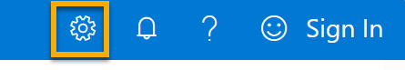

---
lab:
  title: Azure AI 서비스 살펴보기
---

> **중요**
> **Anomaly Detector 랩은 더 이상 사용되지 않으며 아래 업데이트로 대체되었습니다.**

Azure AI 서비스를 사용하면 사용자가 기본 제공 및 미리 빌드되고 사용자 지정 가능한 API 및 모델을 사용하여 AI 애플리케이션을 만들 수 있습니다. 이 연습에서는 Content 금고ty Studio에서 서비스 중 하나인 Azure AI Content 금고ty를 살펴봅니다. 

Content 금고ty Studio를 사용하면 텍스트 및 이미지 콘텐츠를 조정하는 방법을 탐색할 수 있습니다. 샘플 텍스트 또는 이미지에서 테스트를 실행하고 각 범주에 대해 안전에서 높음까지의 심각도 점수를 얻을 수 있습니다. 이 랩 연습에서는 Content 금고ty Studio에서 단일 서비스 리소스를 만들고 해당 기능을 테스트합니다. 

> **** 이 연습의 목표는 Azure AI 서비스를 프로비전하고 사용하는 방법에 대한 일반적인 감각을 얻는 것입니다. 콘텐츠 금고ty는 예로 사용되지만 이 연습에서는 콘텐츠 안전에 대한 포괄적인 지식을 얻을 수 없습니다.

## Content 금고ty Studio 탐색 

1. [Content 금고ty Studio를 엽니다](https://contentsafety.cognitive.azure.com?azure-portal=true). 로그인하지 않은 경우 로그인해야 합니다. 화면 오른쪽 위에서 로그인**을 선택합니다**. Azure 구독과 연결된 전자 메일 및 암호를 사용하여 로그인합니다. 

1. Content 금고ty Studio는 Azure AI 서비스에 대한 다른 많은 스튜디오와 마찬가지로 설정됩니다. 화면 맨 위에 있는 메뉴에서 Azure AI* 왼쪽*의 아이콘을 클릭합니다. Azure AI 서비스를 사용하여 개발하도록 설계된 다른 스튜디오의 드롭다운 목록이 표시됩니다. 아이콘을 다시 클릭하여 목록을 숨길 수 있습니다.

  

## 스튜디오와 리소스 연결 

스튜디오를 사용하기 전에 Azure AI 서비스 리소스를 스튜디오와 연결해야 합니다. 스튜디오에 따라 특정 단일 서비스 리소스가 필요하거나 일반적인 다중 서비스 리소스를 사용할 수 있습니다. Content 금고ty Studio의 경우 단일 서비스 *Content 금고ty* 리소스 또는 *Azure AI 서비스 일반 다중 서비스 리소스를* 만들어 서비스를 사용할 수 있습니다. 아래 단계에서는 단일 서비스 콘텐츠 금고ty 리소스를 만듭니다. 

1. 화면 오른쪽 위에서 설정** 아이콘을 **클릭합니다. 

1. **설정** 페이지에 디렉터리 탭과 *리소스* 탭이 ** 표시됩니다. 리소스 탭에서 *새 리소스** 만들기를 선택합니다**.* 그러면 Azure Portal에서 리소스를 만들기 위해 페이지로 이동합니다.

> **참고** 디렉터 *리* 탭을 사용하면 사용자가 리소스를 만들 다른 디렉터리를 선택할 수 있습니다. 다른 디렉터리를 사용하려는 경우가 아니면 설정을 변경할 필요가 없습니다. 

1. Azure Portal[의 *콘텐츠 만들기 금고ty* 페이지에서 ](https://portal.azure.com?auzre-portal=true)리소스를 만들려면 몇 가지 세부 정보를 구성해야 합니다. 다음 설정을 사용하여 구성합니다.
    - **구독**: *자신의 Azure 구독*.
    - **리소스 그룹**: *고유한 이름이 있는 리소스 그룹을 선택하거나 생성*합니다.
    - **지역**: 사용 가능한 지역을 선택합니다**.
    - **이름**: 고유한 이름을 입력합니다.
    - **가격 책정 계층**: 무료 F0

1. 검토 + 만들기**를 선택하고 **구성을 검토합니다. 다음으로 **만들기**를 선택합니다. 배포가 완료되면 화면이 표시됩니다. 

*축! Azure AI 서비스 리소스를 방금 만들거나 프로비전했습니다. 특히 프로비전한 것은 단일 서비스 Content 금고ty 서비스 리소스입니다.*

1. 배포가 완료되면 새 탭을 열고 Content 금고ty Studio[로 돌아갑니다](https://contentsafety.cognitive.azure.com?azure-portal=true). 

1. 화면 오른쪽 위에 있는 **설정** 아이콘을 다시 선택합니다. 이번에는 새로 만든 리소스가 목록에 추가된 것을 볼 수 있습니다.  

1. Content 금고ty Studio의 설정 페이지에서 방금 만든 Azure AI 서비스 리소스를 선택하고 화면 아래쪽에서 리소스** 사용을 클릭합니다**. 스튜디오 홈페이지로 돌아갑니다. 이제 새로 만든 리소스로 스튜디오 사용을 시작할 수 있습니다.

## Content 금고ty Studio에서 텍스트 조정 사용해 보기

1. Content 금고ty Studio 홈페이지의 조정 테스트 실행 아래에서 *중간 텍스트 콘텐츠** 상자로 **이동하고 [시도 **]를 클릭합니다**.*
1. 간단한 테스트를 실행한 후 금고 콘텐츠를** 클릭합니다**. 아래 상자에 텍스트가 표시됩니다. 
1. **테스트 실행**을 클릭합니다. 테스트를 실행하면 Content 금고ty Service의 딥 러닝 모델이 호출됩니다. 딥 러닝 모델은 안전하지 않은 콘텐츠를 인식하도록 이미 학습되었습니다.
1. *결과* 패널에서 결과를 검사합니다. 안전성에서 높음까지의 4가지 심각도 수준과 4가지 유형의 유해한 콘텐츠가 있습니다. Content 금고ty AI 서비스는 이 샘플을 허용 가능한 것으로 간주하나요? 중요한 점은 결과가 신뢰 구간 내에 있다는 것입니다. Azure AI의 기본 모델 중 하나와 같이 잘 학습된 모델은 사람이 결과에 레이블을 지정하는 것과 일치할 확률이 높은 결과를 반환할 수 있습니다. 테스트를 실행할 때마다 모델을 다시 호출합니다. 
1. 이제 다른 샘플을 사용해 보세요. 맞춤법이 틀린 폭력 콘텐츠 아래의 텍스트를 선택합니다. 콘텐츠가 아래 상자에 표시되는지 확인합니다.
1. 테스트** 실행을 클릭하고 **결과 패널에서 결과를 다시 검사합니다. 

제공된 모든 샘플에서 테스트를 실행한 다음 결과를 검사할 수 있습니다.

## 키 및 엔드포인트 확인

테스트한 이러한 기능은 모든 종류의 애플리케이션으로 프로그래밍할 수 있습니다. 애플리케이션 개발에 사용되는 키와 엔드포인트는 Content 금고ty Studio와 Azure Portal에서 모두 찾을 수 있습니다. 

1. Content 금고ty Studio에서 리소스* 탭이 **선택된 설정** 페이지로 *다시 이동합니다. 사용한 리소스를 찾습니다. 스크롤하여 리소스의 엔드포인트 및 키를 확인합니다. 
1. Azure Portal에서 리소스에 대해 *동일한* 엔드포인트 및 *다른* 키임을 알 수 있습니다. 검사 Azure Portal[로 ](https://portal.azure.com?auzre-portal=true)이동합니다. 위쪽 검색 창에서 *콘텐츠 금고ty*를 검색합니다. 리소스를 찾아 클릭합니다. 왼쪽 메뉴에서 키 및 엔드포인트에 대한 *리소스 관리를* 확인*합니다*. 키 및 엔드포인트를** 선택하여 **리소스의 엔드포인트 및 키를 봅니다. 

완료되면 Azure Portal에서 Content 금고ty 리소스를 삭제할 수 있습니다. 리소스를 삭제하면 리소스가 구독에 있을 때 발생하는 비용을 줄일 수 있습니다. 이렇게 하려면 Content 금고ty 리소스의 개요** 페이지로 이동합니다**. 화면 위쪽에서 삭제**를 선택합니다**. 
