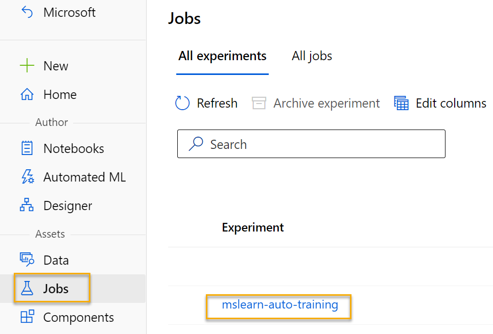
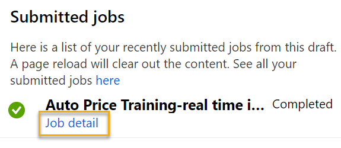

---
lab:
  title: Azure Machine Learning 디자이너를 사용하여 회귀 살펴보기
---

# Azure Machine Learning 디자이너를 사용하여 회귀 살펴보기

> **참고** 이 랩을 완료하려면 관리 액세스 권한이 있는 [Azure 구독](https://azure.microsoft.com/free?azure-portal=true)이 필요합니다.

이 연습에서는 특성에 따라 자동차 가격을 예측하는 회귀 모델을 학습합니다.

## Azure Machine Learning 작업 영역 만들기  

1. Microsoft 자격 증명을 사용하여 [Azure Portal](https://portal.azure.com?azure-portal=true)에 로그인합니다.

1. **+ 리소스 만들기**를 선택하고, *Machine Learning*을 검색한 뒤 *Azure Machine Learning* 플랜을 사용하여 새 **Azure Machine Learning** 리소스를 만듭니다. 다음 설정을 사용합니다.
    - **구독**: *자신의 Azure 구독*.
    - **리소스 그룹**: 리소스 그룹 만들거나 선택하기
    - **작업 영역 이름**: 작업 영역의 고유한 이름 입력
    - **지역**: 지리적으로 가장 가까운 지역 선택
    - **스토리지 계정**: 작업 영역에 대해 만들 새로운 기본 스토리지 계정
    - **키 자격 증명 모음**: 작업 영역에 대해 만들 새로운 기본 키 자격 증명 모음
    - **Application insights**: 작업 영역에 대해 만들 새로운 기본 Application Insights 리소스
    - **컨테이너 레지스트리**: 없음(‘처음으로 컨테이너에 모델을 배포할 때 자동으로 만들어짐’)

1. **검토 + 생성**를 선택한 다음, **생성**를 선택합니다. 작업 영역이 만들어질 때까지 기다린 다음(몇 분 정도 걸릴 수 있음) 배포된 리소스로 이동합니다.

1. **Studio 시작**을 선택하거나 또는 새 브라우저 탭을 열고 [https://ml.azure.com](https://ml.azure.com?azure-portal=true)로 이동한 다음, Microsoft 계정을 사용하여 Azure Machine Learning 스튜디오에 로그인합니다.

1. Azure Machine Learning 스튜디오에서 새로 만든 작업 영역이 표시됩니다. 그렇지 않은 경우 왼쪽 메뉴에서 Azure 디렉터리를 선택합니다. 그런 다음 새 왼쪽 메뉴에서 디렉터리에 연결된 모든 **작업 영역**이 나열된 작업 영역을 선택하고 이 연습에 대해 만든 작업 영역을 선택합니다.

> **참고** 이 모듈은 [Microsoft Azure AI 기본 사항: 기계 학습을 위한 시각적 도구 살펴보기](https://docs.microsoft.com/learn/paths/create-no-code-predictive-models-azure-machine-learning/) 학습 경로의 다른 모듈을 포함하여 Azure Machine Learning 작업 영역을 활용하는 여러 모듈 중 하나입니다. 고유한 Azure 구독을 사용하는 경우 작업 영역을 만든 후 다른 모듈에서 다시 사용하는 것이 좋습니다. 사용자의 구독에 Azure Machine Learning 작업 영역이 존재하는 동안에는 Azure 구독에 약간의 데이터 스토리지 요금이 청구됩니다. 따라서 더 이상 필요하지 않은 경우 Azure Machine Learning 작업 영역을 삭제하는 것이 좋습니다.

## 컴퓨팅 만들기

1. [Azure Machine Learning 스튜디오](https://ml.azure.com?azure-portal=true) 왼쪽 위에 있는 **&#8801;** 아이콘(세 줄의 스택처럼 보이는 메뉴 아이콘)을 선택하여 인터페이스의 다양한 페이지를 봅니다(화면 크기를 최대화해야 할 수 있음). 왼쪽 창에서 해당 페이지를 사용하여 작업 영역에서 리소스를 관리할 수 있습니다. **컴퓨팅** 페이지(**관리** 아래)를 선택합니다.

1. **컴퓨팅** 페이지에서 **컴퓨팅 클러스터** 탭을 선택하고 다음 설정의 새 컴퓨팅 클러스터를 추가하여 기계 학습 모델을 학습합니다.
    - **위치**: 작업 영역과 동일한 위치를 선택합니다. 해당 위치가 나열되어 있지 않으면 가장 가까운 위치를 선택합니다.
    - **가상 머신 계층**: 전용
    - **가상 머신 유형**: CPU
    - **가상 머신 크기**:
        - **모든 옵션에서 선택** 선택
        - **Standard_DS11_v2**를 검색하고 선택
    - **다음**을 선택합니다.
    - **컴퓨팅 이름**: 고유한 이름 입력
    - **최소 노드 수**: 0
    - **최대 노드 수**: 2
    - **스케일 다운 전 유휴 시간(초)**: 120
    - **SSH 액세스 사용**: 지우기
    - **만들기**를 선택합니다.

> **참고**: 컴퓨팅 인스턴스 및 클러스터는 표준 Azure 가상 머신 이미지를 기반으로 합니다. 이 모듈에서는 비용 및 성능의 최적 균형을 달성하기 위해 *Standard_DS11_v2* 이미지를 권장합니다. 구독에 이 이미지를 포함하지 않는 할당량이 있는 경우 다른 이미지를 선택하세요. 하지만 이미지가 클수록 비용이 더 많이 들 수 있고 더 작은 이미지는 작업을 완료하기에 충분하지 않을 수 있습니다. 또는 Azure 관리자에게 할당량을 확장하도록 요청하세요.

컴퓨팅 클러스터는 만들어지는 데 시간이 좀 걸립니다. 대기하는 동안 다음 단계로 이동할 수 있습니다.

## 디자이너에서 파이프라인 만들기 

1. [Azure Machine Learning 스튜디오](https://ml.azure.com?azure-portal=true) 화면 왼쪽 위에 있는 메뉴 아이콘을 선택하여 왼쪽 창을 확장합니다. **작성자** 아래에 있는 **디자이너** 페이지를 보고 **+** 를 선택하여 새 파이프라인을 만듭니다.

1. 화면의 오른쪽 위에서 **설정** 선택합니다. **설정** 창이 표시되지 않으면 위쪽의 파이프라인 이름 옆에 있는 바퀴 아이콘을 선택합니다.

1. **설정**에서 파이프라인을 실행할 컴퓨팅 대상을 지정해야 합니다. **컴퓨팅 유형 선택**에서 **컴퓨팅 클러스터**를 선택합니다. 그런 다음 **Azure ML 컴퓨팅 클러스터 선택**에서 이전에 만든 컴퓨팅 클러스터를 선택합니다.

1. **설정**의 **초안 세부 정보**에서 초안 이름(**파이프라인 생성 날짜**)을 **자동 가격 학습**으로 변경합니다.

1. **설정** 창의 오른쪽 위에 있는 *닫*기 아이콘을 선택하여 창을 닫습니다. 


## 데이터 세트 추가 및 탐색

Azure Machine Learning에는 회귀 모델에 사용할 수 있는 샘플 데이터 세트가 포함되어 있습니다.

1. 왼쪽의 파이프라인 이름 옆에 있는 화살표 아이콘을 선택하여 패널이 아직 확장되어 있지 않은 경우 확장합니다. 패널은 기본적으로 패널 맨 위에 책 아이콘으로 표시된 **자산 라이브러리** 창으로 열립니다. 창에서 자산을 찾기 위한 검색 창과 **데이터** 및 **구성 요소**라는 두 개의 단추가 있습니다.

    

1. **구성 요소**를 클릭합니다. **자동차 가격 데이터(원시)** 데이터 세트를 찾아 캔버스에 배치합니다.

1. 캔버스의 **자동차 가격 데이터(원시)** 데이터 세트를 오른쪽 마우스 단추로 클릭(Mac에서는 Ctrl+클릭)하고 **데이터 미리 보기**를 클릭합니다.

1. 데이터의 데이터 세트 출력 스키마를 검토하여 다양한 열의 분포를 히스토그램으로 확인할 수 있습니다.

1. 모델에서 예측하는 레이블인 **Price** 열이 표시될 때까지 데이터 세트의 오른쪽으로 스크롤합니다.

1. 다시 왼쪽으로 스크롤하고 **normalized-losses** 열 헤더를 선택합니다. 이 열에 대한 통계를 검토합니다. 이 열에는 누락된 값이 많습니다. 누락된 값이 있으면 **가격** 레이블을 예측할 때 열의 유용성이 제한되므로 학습에서 제외하는 것이 좋습니다.

1. 다음과 같이 캔버스에서 데이터 세트를 볼 수 있도록 **자동차 가격 데이터(원시) 결과 시각화** 창을 닫습니다.

    

## 데이터 변환 추가

일반적으로 데이터 변환을 적용하여 모델링용 데이터를 준비합니다. 자동차 가격 데이터의 경우 데이터를 탐색할 때 확인된 문제를 해결하기 위해 변환을 추가합니다.

1. 왼쪽의 **자산 라이브러리** 창에서 **구성 요소**를 클릭합니다. 여기에는 데이터 변환 및 모델 학습에 사용할 수 있는 다양한 모듈이 포함되어 있습니다. 검색 창을 사용해 모듈을 빠르게 찾을 수도 있습니다.

1. **데이터 세트에서 열 선택** 모듈을 찾아 캔버스에서 **자동차 가격 데이터(원시)** 모듈 아래에 놓습니다. 그런 다음 다음과 같이 **자동차 가격 데이터(원시)** 모듈 하단의 출력을 **데이터 세트에서 열 선택** 모듈 상단의 입력에 연결합니다.

    

1. **데이터 세트에서 열 선택** 모듈을 두 번 클릭하여 오른쪽에 있는 설정 창에 액세스합니다. **열 편집**을 선택합니다. 그런 다음 **열 선택** 창에서 **이름별**을 선택하고 **모두 추가**를 선택하여 모든 열을 추가합니다. 그런 다음 **정규화 손실**을 제거하면 최종 열 선택이 다음과 같이 표시됩니다.

    

1. **저장** 단추를 클릭합니다.

이 연습의 나머지 부분에서는 다음과 같은 파이프라인을 만드는 단계를 수행합니다.


필요한 모듈을 추가하고 구성할 때 이미지를 참조로 사용하여 나머지 단계를 수행합니다.

1. **자산 라이브러리**의 **누락된 데이터 정리** 모듈을 찾아 캔버스에 있는 **데이터 세트에서 열 선택** 모듈 아래에 배치합니다. 그런 다음 **데이터 세트에서 열 선택** 모듈의 출력을 **누락된 데이터 정리** 모듈의 입력에 연결합니다.

1. **누락된 데이터 정리** 모듈을 두 번 클릭하고 오른쪽 창에서 **열 편집**을 클릭합니다. **정리할 열** 창에서 **규칙 사용**을 선택하고, **포함** 목록에서 **열 이름**을 선택한 다음, 열 이름 상자에 다음과 같이 **bore**, **stroke**, **horsepower**를 입력합니다.

    

1. **누락된 데이터 정리** 모듈을 선택한 상태로 오른쪽 창에서 다음 구성을 설정합니다.
    - **최소 누락 값 비율**: 0.0
    - **최대 누락 값 비율**: 1.0
    - **정리 모드**: 전체 행 제거

    >**팁** **bore**, **stroke**, **horsepower** 열의 통계를 보면 누락된 값의 개수를 확인할 수 있습니다. 해당 열은 **normalized-losses**보다 누락된 값이 더 적으므로, 값이 누락된 행을 학습에서 제외한다면 **가격**을 예측하는 데 유용할 수 있습니다.

1. **자산 라이브러리**에서 **데이터 정규화** 모듈을 찾아서 **누락된 데이터 정리** 모듈 아래 캔버스에 배치합니다. 그런 다음 **누락된 데이터 정리** 모듈의 가장 왼쪽에 있는 출력과 **데이터 정규화** 모듈의 입력을 연결합니다.

1. **데이터 정규화** 모듈을 두 번 클릭하여 해당 매개 변수 창을 봅니다. 변환 방법과 변환할 열을 지정해야 합니다. 변환 메서드를 **MinMax**로 설정합니다. 다음 **열 이름**을 포함하도록 **열 편집**을 선택하여 규칙을 적용합니다.
    - **symboling**
    - **wheel-base**
    - **length**
    - **width**
    - **height(높이)**
    - **curb-weight**
    - **engine-size**
    - **bore**
    - **stroke**
    - **compression-ratio**
    - **horsepower**
    - **peak-rpm**
    - **city-mpg**
    - **highway-mpg**

    

    >**팁** **stroke**, **peak-rpm**, **city-mpg** 열의 값을 비교하면 모든 열이 서로 다른 척도로 측정되었으므로 **peak-rpm**의 큰 값으로 인해 학습 알고리즘이 편중되어 **stroke**와 같은 값이 더 낮은 열에 비해 해당 열에 과도하게 종속될 수 있습니다. 일반적으로 데이터 과학자는 숫자 열을 비슷한 기준에 기초하도록 ‘정규화’하여 해당 편중을 최소화합니다.

## 파이프라인 실행

데이터 변환을 적용하려면 파이프라인을 실행해야 합니다.

1. 파이프라인이 다음 이미지와 비슷한지 확인합니다.

    

1. **제출**을 선택하고 컴퓨팅 클러스터에서 **mslearn-auto-training**이라는 새 실험을 만듭니다.

1. 실행이 완료될 때까지 기다립니다. 5분 이상 걸릴 수 있습니다.

    

    이제 왼쪽 패널이 **제출된 작업** 창에 있습니다. 작업의 상태가 **완료**로 변경되므로 실행이 완료되는 시기를 알 수 있습니다. 

1. 실행이 완료되면 **작업 세부 정보**를 클릭합니다. 새 탭이 열리고 다음과 같은 확인 표시로 완료된 구성 요소가 표시됩니다.

    

이제 모델 학습을 위한 데이터 세트가 준비되었습니다. 파이프라인으로 돌아가려면 작업 세부 정보 탭을 닫습니다.

## 학습 파이프라인 만들기

데이터 변환을 사용하여 데이터를 준비한 후에는 이를 사용하여 기계 학습 모델을 학습할 수 있습니다. 다음 단계를 수행하여 **자동차 가격 학습** 파이프라인을 확장합니다.

1. 아직 열려 있지 않다면 이전 단원에서 만든 **자동차 가격 학습** 파이프라인으로 돌아갑니다.

1. 왼쪽 창에 있는 **자산 라이브러리**에서 **데이터 분할** 모듈을 찾아 **데이터 정규화** 모듈의 아래에 있는 캔버스로 끌어 놓습니다. 그런 다음 **데이터 정규화** 모듈의 ‘변환된 데이터 세트(왼쪽)’ 출력을 **데이터 분할** 모듈의 입력에 연결합니다.

    >**팁** 검색 창을 사용하면 모듈을 빠르게 찾을 수 있습니다. 

1. **데이터 분할** 모듈을 두 번 클릭하고, 다음과 같이 설정을 구성합니다.
    * **분할 모드**: 행 분할
    * **첫 번째 출력 데이터 세트에서 행의 비율**: 0.7
    * **임의 분할**: True
    * **무작위 초기값**: 123
    * **계층화된 분할**: 아니요

1. **자산 라이브러리**에서 **모델 학습** 모듈을 찾아 **데이터 분할** 모듈 아래의 캔버스에 배치합니다. 그런 다음 **데이터 분할** 모듈의 결과 데이터 세트 1(왼쪽) 출력을 **모델 학습** 모듈의 데이터 세트 (오른쪽) 입력에 연결합니다.

1. 학습하고 있는 모델은 **가격** 값을 예측하므로 **모델 학습** 모듈을 선택하고 해당 설정을 수정하여 **레이블 열**을 **가격**으로 설정합니다(대소문자 표시 및 철자가 정확히 일치해야 함).

    모델에서 예측하는 **가격** 레이블은 숫자 값이므로 ‘회귀’ 알고리즘을 사용하여 모델을 학습해야 합니다.

1. **자산 라이브러리**에서 **선형 회귀** 모듈을 검색하여 **데이터 분할** 모듈의 왼쪽, **모델 학습** 모듈의 위쪽에 있는 캔버스에 배치합니다. 그런 다음 출력을 **모델 학습** 모듈의 **학습되지 않은 모델**(왼쪽) 입력에 연결합니다.

    > **참고** 회귀 모델을 학습하는 데 사용할 수 있는 여러 알고리즘이 있습니다. 이를 선택하는 데 도움이 필요하면 [Azure Machine Learning 디자이너용 기계 학습 알고리즘 치트 시트](https://aka.ms/mlcheatsheet?azure-portal=true)를 살펴보세요.

    학습된 모델을 테스트하기 위해, 원래 데이터를 분할할 때 따로 분리해 두었던 유효성 검사 데이터 세트를 ‘채점’합니다. 즉, 유효성 검사 데이터 세트의 특징에 대해 레이블을 예측합니다.
 
1. **자산 라이브러리**에서 **모델 학습** 모듈 아래 캔버스에 **모델 채점** 모듈을 검색하여 배치합니다. 그런 다음 **모델 학습** 모듈의 출력을 **모델 채점** 모듈의 **학습된 모델**(왼쪽) 입력에 연결하고 **데이터 분할** 모듈의 **결과 데이터 세트2**(오른쪽) 출력을 **모델 채점** 모듈의 **데이터 세트**(오른쪽) 입력에 끌어다 놓습니다.

1. 파이프라인은 다음 이미지와 같아야 합니다.

    

## 학습 파이프라인 실행

이제 학습 파이프라인을 실행하고 모델을 학습할 준비가 되었습니다.

1. **제출**을 선택하고 **mslearn-auto-training**이라는 기존 실험을 사용하여 파이프라인을 실행합니다.

1. 실험 실행을 완료하는 데는 5분 이상 걸립니다. 실험 실행이 완료되면 **작업 세부 정보**를 클릭합니다. 새 탭으로 이동됩니다.

1. 새 창에서 **점수 모델** 모듈을 마우스 오른쪽 단추로 클릭하고 **데이터 미리 보기**를 선택한 다음 **점수가 매겨진 데이터 집합**을 선택하여 결과를 봅니다.

1. 오른쪽으로 스크롤하면 **가격** 열(레이블의 알려진 실제 값이 포함됨) 옆에 예측 레이블 값을 포함하는 **점수가 매겨진 레이블**이라는 새 열이 있습니다.

1. **모델 채점 결과 시각화** 탭을 닫습니다.

모델에서 **가격** 레이블의 값을 예측하지만 그 예측은 얼마나 신뢰할 만한 것일까요? 이를 평가하려면 모델을 평가해야 합니다.

## 모델 평가

회귀 모델을 평가하는 한 가지 방법은 예측된 레이블을 학습 중에 보류할 유효성 검사 데이터 세트의 실제 레이블과 비교하는 것입니다. 또 다른 방법은 여러 모델의 성능을 비교하는 것입니다.

1. 만든 **자동차 가격 학습** 파이프라인을 엽니다.

1. **자산 라이브러리**에서 **모델 평가** 모듈을 검색하여 캔버스의 **모델 채점** 모듈 아래에 배치하고, **모델 채점** 모듈의 출력을 **모델 평가** 모듈의 **점수가 매겨진 데이터 세트**(왼쪽) 입력에 연결합니다.

1. 파이프라인이 다음과 같아야 합니다.

    

1. **제출**을 선택하고 **mslearn-auto-training**이라는 기존 실험을 사용하여 파이프라인을 실행합니다.

1. 실험이 완료될 때까지 기다립니다.

    

1. 실험 실행이 완료되어 **작업 세부 정보**를 선택하여 다른 탭을 엽니다. **모델 평가** 모듈을 찾아서 마우스 오른쪽 단추로 클릭합니다. **데이터 미리 보기**를 선택한 다음 **, 평가 결과**를 선택합니다.

    

1. *Evaluation_results* 창에서 회귀 성능 메트릭을 검토합니다.
    - **MAE(평균 절대 오차)**
    - **RMSE(제곱 평균 오차)**
    - **RSE(상대 제곱 오차)**
    - **RAE(상대 절대 오차)**
    - **결정 계수(R<sup>2</sup>)**
1. *Evaluation_results* 창을 닫습니다.

요구 사항에 맞는 평가 메트릭을 사용하는 모델을 발견했다면, 해당 모델을 새 데이터와 함께 사용할 준비를 할 수 있습니다.

## 유추 파이프라인 만들기 및 실행

1. Azure Machine Learning 스튜디오 화면 왼쪽 위에 있는 메뉴 아이콘을 선택하여 왼쪽 창을 확장합니다. **작업**(**자산** 아래)을 클릭하여 실행한 모든 작업을 봅니다. 실험 **mslearn-auto-training**을 선택한 다음, **mslearn-auto-training** 파이프라인을 선택합니다. 

    

1. 캔버스 위의 메뉴를 찾아 **유추 파이프라인 만들기**를 클릭합니다. 메뉴에서 **유추 파이프라인 만들기**를 찾으려면 화면을 전체 화면으로 확장하고 화면의 오른쪽 위 모서리에 있는 세 개의 점 아이콘 **...** 을 클릭해야 할 수 있습니다.  

    

1. **유추 파이프라인 만들기** 드롭다운 목록에서 **실시간 유추 파이프라인**을 클릭합니다. 몇 초 후에 **자동차 가격 학습-실시간 유추**라는 파이프라인의 새 버전이 열립니다.

                  파이프라인에 **웹 서비스 입력**과 **웹 서비스 출력** 모듈이 포함되지 않은 경우 **디자이너** 페이지로 돌아가 **자동차 가격 학습-실시간 유추** 파이프라인을 다시 엽니다.

1. 새 파이프라인의 이름을 **자동차 가격 예측**으로 바꾸고 새 파이프라인을 검토합니다. 여기에는 제출할 새 데이터에 대한 웹 서비스 입력과 결과를 반환하기 위한 웹 서비스 출력이 포함되어 있습니다. 일부 변환 및 학습 단계가 이 파이프라인의 일부입니다. 학습된 모델은 새 데이터의 점수를 매기는 데 사용됩니다.

    다음 5~9단계에서 유추 파이프라인을 다음과 같이 변경합니다.

    

   다음 단계에서 파이프라인을 수정할 때 참조용 이미지를 사용합니다.

1. 유추 파이프라인은 새 데이터가 원래 학습 데이터의 스키마와 일치하는 것으로 가정하므로 학습 파이프라인의 **자동차 가격 데이터(원시)** 데이터 세트가 포함됩니다. 하지만 해당 입력 데이터에는 모델이 예측하는 **가격** 레이블이 포함되어 있으므로, 아직 가격 예측이 이루어지지 않은 새 자동차 데이터에 이를 포함시키는 것은 비논리적입니다. 해당 모듈을 삭제하고 **데이터 입력 및 출력** 섹션에 있는 **수동으로 데이터 입력** 모듈로 바꾸어 다음 CSV 데이터를 포함시킵니다. 여기에는 세 대의 자동차에 대해 레이블이 없는 특징 값이 포함됩니다(텍스트 블록 전체를 복사하여 붙여넣기).

    ```CSV
    symboling,normalized-losses,make,fuel-type,aspiration,num-of-doors,body-style,drive-wheels,engine-location,wheel-base,length,width,height,curb-weight,engine-type,num-of-cylinders,engine-size,fuel-system,bore,stroke,compression-ratio,horsepower,peak-rpm,city-mpg,highway-mpg
    3,NaN,alfa-romero,gas,std,two,convertible,rwd,front,88.6,168.8,64.1,48.8,2548,dohc,four,130,mpfi,3.47,2.68,9,111,5000,21,27
    3,NaN,alfa-romero,gas,std,two,convertible,rwd,front,88.6,168.8,64.1,48.8,2548,dohc,four,130,mpfi,3.47,2.68,9,111,5000,21,27
    1,NaN,alfa-romero,gas,std,two,hatchback,rwd,front,94.5,171.2,65.5,52.4,2823,ohcv,six,152,mpfi,2.68,3.47,9,154,5000,19,26
    ```

1. 새로운 **수동으로 데이터 입력** 모듈을 **웹 서비스 입력**과 동일한 **데이터 세트에서 열 선택** 모듈의 **데이터 세트** 입력으로 연결합니다.

1. 들어오는 데이터의 스키마를 변경하여 **가격** 필드를 제외했으므로 남은 모듈에서 해당 필드를 사용할 수 없도록 제거해야 합니다. **데이터 세트에서 열 선택** 모듈을 선택한 다음 설정 창에서 열을 수정하여 **가격** 필드를 제거합니다.

1. 유추 파이프라인에는 새 데이터로부터 예측하기에 유용하지 않은 **모델 평가** 모듈이 포함되어 있으므로 해당 모듈을 삭제합니다.

1. **모델 채점** 모듈의 출력에는 모든 입력 특징 및 예측된 레이블도 포함됩니다. 예측만 포함하도록 출력을 수정하려면 다음을 수행합니다.
    - **모델 점수 매기기** 모듈과 **웹 서비스 출력** 간의 연결을 삭제합니다.
    - **Python 언어** 섹션에서 **Python 스크립트 실행** 모듈을 추가하고 모든 기본 Python 스크립트를 다음 코드로 바꿉니다(**점수가 매겨진 레이블** 열만 선택하고 **predicted_price**로 이름 변경).

```Python
import pandas as pd

def azureml_main(dataframe1 = None, dataframe2 = None):

    scored_results = dataframe1[['Scored Labels']]
    scored_results.rename(columns={'Scored Labels':'predicted_price'},
                        inplace=True)
    return scored_results
```

1. **모델 점수 매기기** 모듈의 출력을 **Python 스크립트 실행**의 **Dataset1**(맨 왼쪽) 입력에 연결하고 **Python 스크립트 실행** 모듈의 출력을 **웹 서비스 출력**에 연결합니다.

1. 파이프라인이 다음 이미지와 유사한지 확인합니다.

    

1. 컴퓨팅 클러스터에서 **mslearn-auto-inference**라는 새 실험으로 파이프라인을 제출합니다. 실험을 실행하는 데 시간이 걸릴 수 있습니다.

1. 파이프라인이 완료되면 **작업 세부 정보**를 선택합니다. 새 탭에서 **Python 스크립트 실행** 모듈을 마우스 오른쪽 단추로 클릭합니다. **데이터 미리 보기**를 선택한 다음 **결과 데이터 세트**를 선택하여 입력 데이터의 자동차 3대에 대한 예상 가격을 확인합니다.

1. 시각화 탭을 닫습니다.

유추 파이프라인은 해당 특징에 따라 자동차 가격을 예측합니다. 이제 클라이언트 애플리케이션에서 사용할 수 있도록 파이프라인을 게시할 준비가 되었습니다.

## 모델 배포

실시간 추론용 추론 파이프라인을 만들고 테스트한 후에는 이를 클라이언트 응용 프로그램에서 사용할 서비스로 게시할 수 있습니다.

> **참고** 이 연습에서는 ACI(Azure Container Instance)에 웹 서비스를 배포합니다. 이러한 유형의 컴퓨팅은 동적으로 만들어지며 개발 및 테스트에 유용합니다. 프로덕션 환경에서는 ‘유추 클러스터’를 만들어 향상된 스케일링 성능 및 보안을 제공하는 AKS(Azure Kubernetes Service) 클러스터를 제공해야 합니다.

## 서비스 배포

1. 이전 단원에서 만든 **자동차 가격 예측** 유추 파이프라인을 확인합니다.

1. 왼쪽 창에서 **작업 세부 정보**를 선택하면 새 탭이 열립니다.

    

1. 새 탭에서 **배포**를 선택합니다.

    

1. 구성 화면에서 다음 설정을 사용하여 **새 실시간 엔드포인트 배포**를 선택합니다.
    -  **이름**: predict-auto-price
    -  **설명**: 자동차 가격 회귀 분석
    - **컴퓨팅 형식**: Azure Container Instances

1. 웹 서비스가 배포될 때까지 몇 분 정도 기다립니다. 배포 상태는 디자이너 인터페이스의 왼쪽 상단에 표시됩니다.

## 서비스 테스트

1. **엔드포인트** 페이지에서 **predict-auto-price** 실시간 엔드포인트를 엽니다.

    

1. **predict-auto-price** 엔드포인트가 열리면 **테스트** 탭을 선택합니다. 이 탭은 새 데이터로 모델을 테스트하는 데 사용합니다. **실시간 엔드포인트를 테스트할 입력 데이터** 아래에서 현재 데이터를 삭제합니다. 아래 데이터를 복사하여 데이터 섹션에 붙여넣습니다.  

    ```json
    {
    "Inputs": {
                "WebServiceInput0":
                [
                    {
                        "symboling": 3,
                        "normalized-losses": 1.0,
                        "make": "alfa-romero",
                        "fuel-type": "gas",
                        "aspiration": "std",
                        "num-of-doors": "two",
                        "body-style": "convertible",
                        "drive-wheels": "rwd",
                        "engine-location": "front",
                        "wheel-base": 88.6,
                        "length": 168.8,
                        "width": 64.1,
                        "height": 48.8,
                        "curb-weight": 2548,
                        "engine-type": "dohc",
                        "num-of-cylinders": "four",
                        "engine-size": 130,
                        "fuel-system": "mpfi",
                        "bore": 3.47,
                        "stroke": 2.68,
                        "compression-ratio": 9,
                        "horsepower": 111,
                        "peak-rpm": 5000,
                        "city-mpg": 21,
                        "highway-mpg": 27
                    }
                ]
            },
    "GlobalParameters": {}
    }
    ```

1. **테스트**를 선택합니다. 화면 오른쪽에 **'predicted_price'** 출력이 표시됩니다. 이 출력은 데이터에 지정된 특정 입력 기능이 있는 자동차의 예상 가격입니다. 

    

수행한 작업을 검토해 보겠습니다. 자동차 데이터의 데이터 세트를 정리하고 변환한 다음, 자동차 *기능*을 사용하여 모델을 학습했습니다. 모델은 *레이블*인 자동차의 가격을 예측합니다.

또한 **사용** 탭의 자격 증명을 사용하여 클라이언트 애플리케이션에 연결할 준비가 된 서비스를 테스트했습니다. 여기서 랩을 종료합니다. 방금 배포한 서비스를 계속 실험해 볼 수 있습니다.

## 정리

만든 웹 서비스는 *Azure Container Instance*에 호스트됩니다. 추가 실험 의사가 없는 경우 불필요한 Azure 사용이 발생하지 않도록 엔드포인트를 삭제해야 합니다. 컴퓨팅 클러스터도 삭제해야 합니다.

1. [Azure Machine Learning Studio](https://ml.azure.com?azure-portal=true)의 **엔드포인트** 탭에서 **predict-auto-price** 엔드포인트를 선택합니다. 그런 다음, **삭제**를 선택하고 엔드포인트를 삭제하겠다고 확인합니다.

1. **컴퓨팅** 페이지의 **컴퓨팅 클러스터** 탭에서 컴퓨팅 클러스터를 선택한 다음, **삭제**를 선택합니다.

>**참고** 컴퓨팅을 삭제하면 컴퓨팅 리소스에 대한 구독 요금이 청구되지 않습니다. 그러나 구독에 Azure Machine Learning 작업 영역이 존재하는 동안에는 약간의 데이터 스토리지 요금이 청구됩니다. Azure Machine Learning 탐색을 완료했으면 Azure Machine Learning 작업 영역 및 관련 리소스를 삭제할 수 있습니다. 그러나 이 시리즈의 다른 랩을 완료하려는 경우에는 다시 만들어야 합니다.
>
> 작업 영역을 삭제하려면,
>
> 1. [Azure Portal](https://portal.azure.com?azure-portal=true)의 **리소스 그룹** 페이지에서 Azure Machine Learning 작업 영역을 만들 때 지정한 리소스 그룹을 엽니다.
> 1. **리소스 그룹 삭제**를 클릭하고 삭제하고자 하는 리소스 그룹 이름을 입력한 다음 **삭제**를 선택합니다.
