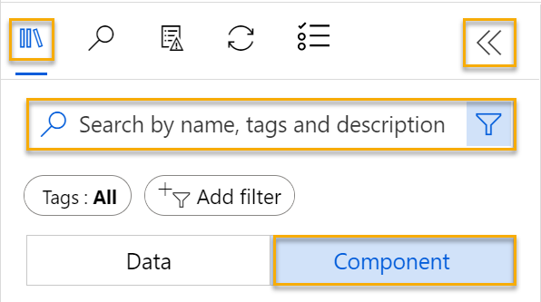
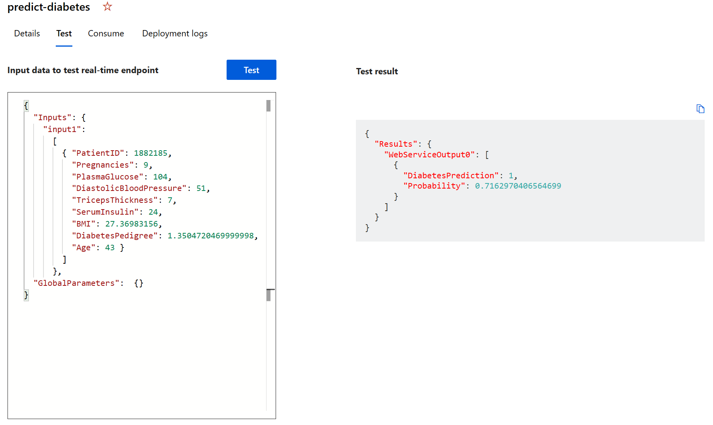

---
lab:
  title: Azure Machine Learning 디자이너를 사용하여 분류 살펴보기
---

# Azure Machine Learning 디자이너를 사용하여 분류 살펴보기

> **참고** 이 랩을 완료하려면 관리 액세스 권한이 있는 [Azure 구독](https://azure.microsoft.com/free?azure-portal=true)이 필요합니다.

## Azure Machine Learning 작업 영역 만들기  

1. Microsoft 자격 증명을 사용하여 [Azure Portal](https://portal.azure.com?azure-portal=true)에 로그인합니다.

1. **+ 리소스 만들기**를 선택하고, *Machine Learning*을 검색한 뒤 *Azure Machine Learning* 플랜을 사용하여 새 **Azure Machine Learning** 리소스를 만듭니다. 다음 설정을 사용합니다.
    - **구독**: *자신의 Azure 구독*.
    - **리소스 그룹**: 리소스 그룹 만들거나 선택하기
    - **작업 영역 이름**: 작업 영역의 고유한 이름 입력
    - **지역**: 지리적으로 가장 가까운 지역 선택
    - **스토리지 계정**: 작업 영역에 대해 만들 새로운 기본 스토리지 계정
    - **키 자격 증명 모음**: 작업 영역에 대해 만들 새로운 기본 키 자격 증명 모음
    - **Application insights**: 작업 영역에 대해 만들 새로운 기본 Application Insights 리소스
    - **컨테이너 레지스트리**: 없음(‘처음으로 컨테이너에 모델을 배포할 때 자동으로 만들어짐’)

1. **검토 + 생성**를 선택한 다음, **생성**를 선택합니다. 작업 영역이 만들어질 때까지 기다린 다음(몇 분 정도 걸릴 수 있음) 배포된 리소스로 이동합니다.

1. **Studio 시작**을 선택하거나 또는 새 브라우저 탭을 열고 [https://ml.azure.com](https://ml.azure.com?azure-portal=true)로 이동한 다음, Microsoft 계정을 사용하여 Azure Machine Learning 스튜디오에 로그인합니다.

1. Azure Machine Learning 스튜디오에서 새로 만든 작업 영역이 표시됩니다. 그렇지 않은 경우 왼쪽 메뉴에서 Azure 디렉터리를 선택합니다. 그런 다음 새 왼쪽 메뉴에서 디렉터리에 연결된 모든 **작업 영역**이 나열된 작업 영역을 선택하고 이 연습에 대해 만든 작업 영역을 선택합니다.

> **참고** 이 모듈은 [Microsoft Azure AI 기본 사항: 기계 학습을 위한 시각적 도구 살펴보기](https://docs.microsoft.com/learn/paths/create-no-code-predictive-models-azure-machine-learning/) 학습 경로의 다른 모듈을 포함하여 Azure Machine Learning 작업 영역을 활용하는 여러 모듈 중 하나입니다. 고유한 Azure 구독을 사용하는 경우 작업 영역을 만든 후 다른 모듈에서 다시 사용하는 것이 좋습니다. 사용자의 구독에 Azure Machine Learning 작업 영역이 존재하는 동안에는 Azure 구독에 약간의 데이터 스토리지 요금이 청구됩니다. 따라서 더 이상 필요하지 않은 경우 Azure Machine Learning 작업 영역을 삭제하는 것이 좋습니다.

## 컴퓨팅 만들기

1. [Azure Machine Learning 스튜디오](https://ml.azure.com?azure-portal=true) 왼쪽 위에 있는 **&#8801;** 아이콘(세 줄의 스택처럼 보이는 메뉴 아이콘)을 선택하여 인터페이스의 다양한 페이지를 봅니다(화면 크기를 최대화해야 할 수 있음). 왼쪽 창에서 해당 페이지를 사용하여 작업 영역에서 리소스를 관리할 수 있습니다. **컴퓨팅** 페이지(**관리** 아래)를 선택합니다.

1. **컴퓨팅** 페이지에서 **컴퓨팅 클러스터** 탭을 선택하고 다음 설정으로 새 컴퓨팅 클러스터를 추가합니다. 이를 사용하여 기계 학습 모델을 학습합니다.
    - **위치**: 작업 영역과 동일한 위치를 선택합니다. 해당 위치가 나열되어 있지 않으면 가장 가까운 위치를 선택합니다.
    - **가상 머신 계층**: 전용
    - **가상 머신 유형**: CPU
    - **가상 머신 크기**:
        - **모든 옵션에서 선택** 선택
        - **Standard_DS11_v2**를 검색하고 선택
    - **다음**을 선택합니다.
    - **컴퓨팅 이름**: 고유한 이름 입력
    - **최소 노드 수**: 0
    - **최대 노드 수**: 2
    - **스케일 다운 전 유휴 시간(초)**: 120
    - **SSH 액세스 사용**: 지우기
    - **만들기**를 선택합니다.

> **참고**: 컴퓨팅 인스턴스 및 클러스터는 표준 Azure 가상 머신 이미지를 기반으로 합니다. 이 모듈에서는 비용 및 성능의 최적 균형을 달성하기 위해 *Standard_DS11_v2* 이미지를 권장합니다. 구독에 이 이미지를 포함하지 않는 할당량이 있는 경우 다른 이미지를 선택하세요. 하지만 이미지가 클수록 비용이 더 많이 들 수 있고 더 작은 이미지는 작업을 완료하기에 충분하지 않을 수 있습니다. 또는 Azure 관리자에게 할당량을 확장하도록 요청하세요.

컴퓨팅 클러스터는 만들어지는 데 시간이 좀 걸립니다. 대기하는 동안 다음 단계로 이동할 수 있습니다.

## 디자이너에서 파이프라인 만들기

Azure Machine Learning 디자이너는 시작하려면 먼저 파이프라인을 만들고 작업하려는 데이터 세트를 추가해야 합니다.

1. [Azure Machine Learning 스튜디오](https://ml.azure.com?azure-portal=true) 화면 왼쪽 위에 있는 메뉴 아이콘을 선택하여 왼쪽 창을 확장합니다. **작성자** 아래에 있는 **디자이너** 페이지를 보고 **+** 를 선택하여 새 파이프라인을 만듭니다.

1. 화면의 오른쪽 위에서 **설정** 선택합니다. **설정** 창이 표시되지 않으면 위쪽의 파이프라인 이름 옆에 있는 바퀴 아이콘을 선택합니다.

1. **설정**에서 파이프라인을 실행할 컴퓨팅 대상을 지정해야 합니다. **컴퓨팅 유형 선택**에서 **컴퓨팅 클러스터**를 선택합니다. 그런 다음 **Azure ML 컴퓨팅 클러스터 선택**에서 이전에 만든 컴퓨팅 클러스터를 선택합니다.

1. **설정**의 **초안 세부 정보**에서 초안 이름(**파이프라인 생성 날짜**)을 **당뇨병 학습**으로 변경합니다.

1. **설정** 창의 오른쪽 위에 있는 닫기 아이콘을 선택하여 창을 닫은 다음, **저장**을 선택합니다.

    

## 데이터 세트 만들기

1. [Azure Machine Learning 스튜디오](https://ml.azure.com?azure-portal=true) 화면 왼쪽 위에 있는 메뉴 아이콘을 선택하여 왼쪽 창을 확장합니다. **데이터** 페이지(**자산** 아래)를 봅니다. 데이터 페이지에는 Azure ML에서 사용할 특정 데이터 파일 또는 테이블이 있습니다. 이 페이지에서도 데이터 세트를 만들 수 있습니다.

1. **데이터** 페이지의 **데이터 자산** 탭에서 **만들기**를 선택합니다. 그런 다음, 다음 설정을 사용하여 데이터 자산을 구성합니다.
    * **데이터 형식**:
        * **이름**: diabetes-data
        * **설명**: 당뇨병 데이터
        * **데이터 세트 형식**: 테이블 형식
    * **데이터 원본**: 웹 파일에서
    * **웹 URL**: 
        * **웹 URL**: https://aka.ms/diabetes-data
        * **데이터 유효성 검사 건너뛰기**: ‘선택하지 않습니다’.
    * **설정**:
        * **파일 형식**: 구분 기호로 분리됨
        * **구분 기호**: 쉼표
        * **인코딩**: UTF-8
        * **열 헤더**: 첫 번째 파일에만 헤더가 있음
        * **행 건너뛰기**: 없음
        * **데이터 세트에 여러 줄 데이터가 포함되어 있음**: 선택하지 마세요.
    * **스키마**:
        * **경로** 이외의 모든 열 포함
        * 자동으로 검색된 형식 검토
    * **검토**
        * **만들기**를 선택합니다.

1. 데이터 세트를 만든 후에는 이를 열고 **탐색** 페이지를 보면서 데이터 샘플을 확인합니다. 이 데이터는 당뇨병에 대한 테스트를 받은 환자의 세부 정보를 나타냅니다.

### 캔버스로 데이터 로드

1. 왼쪽 메뉴에서 **디자이너**를 선택하여 파이프라인으로 돌아갑니다. **디자이너** 페이지에서 **당뇨병 학습** 파이프라인을 선택합니다.

1. 그런 다음, 프로젝트에서 왼쪽의 파이프라인 이름 옆에 있는 화살표 아이콘을 선택하여 패널이 아직 확장되어 있지 않은 경우 확장합니다. 패널은 기본적으로 패널 맨 위에 책 아이콘으로 표시된 **자산 라이브러리** 창으로 열립니다. 자산을 찾을 수 있는 검색 창이 있습니다. **데이터** 및 **구성 요소**의 두 가지 단추가 있습니다.

    

1. **데이터**를 클릭합니다. **diabetes-data** 데이터 세트를 찾아 캔버스에 배치합니다.

1. 캔버스의 **diabetes-data** 데이터 세트를 오른쪽 마우스 버튼으로 클릭(Mac에서는 Ctrl+클릭)하고 **데이터 미리 보기**를 클릭합니다.

1. 프로필 탭에서 데이터의 프로필 스키마를 검토하여 다양한 열의 분포를 히스토그램으로 확인할 수 있습니다.

1. 아래로 스크롤하여 **Diabetic** 열의 열 머리글을 선택하고 **0**과 **1**, 두 값을 포함하고 있는지 확인합니다. 이러한 값은 모델에서 예측하는 레이블에 대해 가능한 두 가지 클래스를 나타내며, **0** 값은 환자가 당뇨병이 아니라는 의미, **1** 값은 당뇨병이라는 의미입니다.

1. 다시 위로 스크롤하고 레이블을 예측하는 데 사용될 기능을 나타내는 다른 열을 검토합니다, 이러한 열의 대부분은 숫자이지만 기능마다 크기가 다릅니다. 예를 들어 **Age** 값의 범위는 21~77인 반면, **DiabetesPedigree** 값의 범위는 0.078~2.3016입니다. 기계 학습 모델을 학습할 때 큰 값에 결과 예측 함수가 좌지우지되어서 작은 규모에 대한 특징의 영향을 줄이는 경우가 간혹 있을 수 있습니다. 일반적으로 데이터 과학자는 숫자 열을 비슷한 기준에 기초하도록 정규화하여 편중을 최소화합니다.

1. 다음과 같이 캔버스에서 데이터 세트를 볼 수 있도록 **diabetes-data의 결과 시각화** 탭을 닫습니다.

    

## 변환 추가

모델을 학습하려면 보통 데이터에 일부 전처리 변환을 적용해야 합니다.

1. 왼쪽의 **자산 라이브러리** 창에서 **구성 요소**를 클릭합니다. 여기에는 데이터 변환 및 모델 학습에 사용할 수 있는 다양한 모듈이 포함되어 있습니다. 검색 창을 사용해 모듈을 빠르게 찾을 수도 있습니다.

    

1. **데이터 세트에서 열 선택** 모듈을 찾아서 **diabetes-data** 데이터 세트 아래에 있는 캔버스에 배치합니다. 그런 다음 **diabetes-data** 데이터 세트 하단의 출력을 **데이터 세트에서 열 선택** 모듈 상단의 입력에 연결합니다.

1. **데이터 세트에서 열 선택** 모듈을 두 번 클릭하여 오른쪽에 있는 설정 창에 액세스합니다. **열 편집**을 선택합니다. 그런 다음 **열 선택** 창에서 **이름으로** 를 선택하고 **모든 열 추가** 를 선택합니다. 그런 다음 **PatientID** 를 제거하고 **저장**을 클릭합니다. 

1. **데이터 정규화** 모듈을 찾아서 **데이터 세트에서 열 선택** 모듈 아래에 있는 캔버스에 배치합니다. 그런 다음 **데이터 세트에서 열 선택** 모듈 하단의 출력을 다음과 같이 **데이터 정규화** 모듈 상단의 입력에 연결합니다.

    

1. **데이터 정규화** 모듈을 두 번 클릭하여 설정을 확인합니다. 여기서 변환 방법 및 변환할 열을 지정해야 한다는 것을 알 수 있습니다. 

1. 변환 메서드를 **MinMax**로 설정하고 선택한 경우 상수 열에 0 사용을 **True**로 설정합니다.  열 편집을 사용하여 변환할 **열을 편집합니다**. **규칙이 있는** 열을 선택하고 다음 목록을 복사하여 포함 열 이름 아래에 붙여넣습니다.  

```
Pregnancies, PlasmaGlucose, DiastolicBloodPressure, TricepsThickness, SerumInsulin, BMI, DiabetesPedigree, Age
```


**저장**을 클릭하고 선택 상자를 닫습니다. 

데이터 변환은 숫자 열을 정규화하여 동일한 규모로 배치하므로, 큰 값이 있는 열이 모델 학습을 좌지우지하지 않도록 합니다. 일반적으로 학습을 위한 데이터를 준비하려고 이와 같은 일련의 사전 처리 변환을 적용하지만 이 연습에서는 작업을 간단하게 유지합니다.

## 파이프라인 실행

데이터 변환을 적용하려면 파이프라인을 실험으로 실행해야 합니다.

1. **제출**을 선택하고 컴퓨팅 클러스터에서 **mslearn-diabetes-training**이라는 새 실험으로 파이프라인을 실행합니다.

1. 실행이 완료될 때까지 몇 분 정도 기다립니다.

    

    이제 왼쪽 패널이 **제출된 작업** 창에 있습니다. 작업의 상태가 **완료**로 변경되므로 실행이 완료되는 시기를 알 수 있습니다.

## 변환된 데이터 보기

1. 실행이 완료되면 이제 모델 학습을 위해 데이터 세트가 준비됩니다. **작업 세부 정보**를 클릭합니다. 새 탭으로 이동됩니다.

1. 캔버스의 **데이터 정규화** 모듈을 마우스 오른쪽 단추로 클릭하고(Mac에서는 Ctrl+클릭) **데이터 미리 보기**를 클릭합니다. **변환된 데이터 집합**을 선택합니다.

1. 데이터를 보고 선택한 숫자 열이 공통 배율로 정규화된 것을 확인합니다.

1. 정규화된 데이터의 결과 시각화를 닫습니다. 이전 탭으로 돌아가기

데이터 변환을 사용하여 데이터를 준비한 후에는 이를 사용하여 기계 학습 모델을 학습할 수 있습니다.

## 학습 모듈 추가

모델을 학습하는 데 사용하는 데이터와, 학습된 모델을 테스트하는 데 사용할 데이터를 서로 구분하는 것이 일반적입니다. 이렇게 하면 모델에서 예측하는 레이블을 원래 데이터 세트의 실제 알려진 레이블과 비교할 수 있습니다.

이 연습에서는 다음과 같이 **Diabetes Training** 파이프라인을 확장하는 단계를 수행합니다.


아래 단계를 따르고, 필요한 모듈을 추가하고 구성할 때 위 이미지를 참조용으로 사용합니다.

1. 아직 열려 있지 않다면 이전 단원에서 만든 **당뇨병 학습** 파이프라인을 엽니다.

1. 왼쪽 창에 있는 **자산 라이브러리**의 **구성 요소**에서 **데이터 분할** 모듈을 검색하여 **데이터 정규화** 모듈 아래의 캔버스에 배치합니다. 그런 다음 **데이터 정규화** 모듈의 ‘변환된 데이터 세트(왼쪽)’ 출력을 **데이터 분할** 모듈의 입력에 연결합니다.

    >**팁** 검색 창을 사용하면 모듈을 빠르게 찾을 수 있습니다.

1. **데이터 분할** 모듈을 선택하고, 다음과 같이 설정을 구성합니다.
    * **분할 모드**: 행 분할
    * **첫 번째 출력 데이터 세트에서 행의 비율**: 0.7
    * **임의 분할**: True
    * **무작위 초기값**: 123
    * **계층화된 분할**: 아니요

1. **자산 라이브러리**에서 **모델 학습** 모듈을 찾아 **데이터 분할** 모듈 아래의 캔버스에 배치합니다. 그런 다음 **데이터 분할** 모듈의 결과 데이터 세트 1(왼쪽) 출력을 **모델 학습** 모듈의 데이터 세트 (오른쪽) 입력에 연결합니다.

1. 학습하고 있는 모델은 **당뇨** 값을 예측하므로 **모델 학습** 모듈을 선택하고 해당 설정을 수정하여 **레이블 열**을 **Diabetic**으로 설정합니다.

    모델에서 예측하는 **Diabetic** 레이블은 클래스(0 또는 1)이므로 분류 알고리즘을 사용하여 모델을 학습해야 합니다. 특히 가능한 클래스가 두 가지이므로 이진 분류 알고리즘이 필요합니다.

1. **자산 라이브러리**에서 **2개의 등급 논리 회귀** 모듈을 검색하여 **데이터 분할** 모듈의 왼쪽, **모델 학습** 모듈의 위쪽에 있는 캔버스에 배치합니다. 그런 다음 출력을 **모델 학습** 모듈의 **학습되지 않은 모델**(왼쪽) 입력에 연결합니다.

   학습된 모델을 테스트하기 위해, 원래 데이터를 분할할 때 따로 분리해 두었던 유효성 검사 데이터 세트를 ‘채점’합니다. 즉, 유효성 검사 데이터 세트의 특징에 대해 레이블을 예측합니다.

1. **자산 라이브러리**에서 **모델 학습** 모듈 아래 캔버스에 **모델 채점** 모듈을 검색하여 배치합니다. 그런 다음 **모델 학습** 모듈의 출력을 **모델 채점** 모듈의 **학습된 모델**(왼쪽) 입력에 연결하고 **데이터 분할** 모듈의 **결과 데이터 세트 2**(오른쪽) 출력을 **모델 채점** 모듈의 **데이터 세트**(오른쪽) 입력에 연결합니다.

## 학습 파이프라인 실행

이제 학습 파이프라인을 실행하고 모델을 학습할 준비가 되었습니다.

1. **제출**을 선택하고 **mslearn-diabetes-training**이라는 기존 실험을 사용하여 파이프라인을 실행합니다.

1. 실험이 완료될 때까지 기다립니다. 5분 이상 걸릴 수 있습니다.

1. 실험 실행이 완료되면 **작업 세부 정보**를 선택합니다. 새 탭으로 이동합니다.

1. 새 탭에서 캔버스의 **모델 채점** 모듈을 마우스 오른쪽 단추로 클릭하고(Mac에서는 Ctrl+클릭) **데이터 미리 보기**를 클릭합니다. **점수가 매겨진 데이터 세트**를 선택하여 결과를 봅니다.

1. 오른쪽으로 스크롤하면 **당뇨병** 열(레이블의 알려진 실제 값이 포함됨) 옆에 예측 레이블 값을 포함하는 **점수가 매겨진 레이블**이라는 새 열이 있으며, 여기에는 예측 레이블 값과 0과 1 사이의 확률을 포함하는 **점수가 매겨진 확률** 열이 포함됩니다. 이는 양성 예측의 확률을 나타내므로 0.5보다 큰 확률은 예측 레이블이 ***1***(당뇨)이 되고 0과 0.5 사이의 확률은 예측 레이블이 ***0***(당뇨 아님)이 됩니다.

1. **모델 채점 결과 시각화** 탭을 닫습니다.

모델에서 **Diabetic** 레이블의 값을 예측하지만 그 예측은 어느 정도 안정적일까요? 이를 평가하려면 모델을 평가해야 합니다.

저장해서 모델 채점에 사용한 유효성 검사 데이터에는 레이블에 대해 알려진 값이 포함됩니다. 따라서 모델의 유효성을 검사하기 위해 유효성 검사 데이터 세트를 채점할 때 예측된 레이블 값과 레이블의 true 값을 비교할 수 있습니다. 이 비교에 따라 모델의 성과를 설명하는 다양한 메트릭을 계산할 수 있습니다.

## 모델 평가 모듈 추가

1. 만든 **당뇨병 학습** 파이프라인을 엽니다.

1. **자산 라이브러리**에서 **모델 평가** 모듈을 검색하여 캔버스의 **모델 채점** 모듈 아래에 배치하고, **모델 채점** 모듈의 출력을 **모델 평가** 모듈의 **점수가 매겨진 데이터 세트**(왼쪽) 입력에 연결합니다.

1. 파이프라인이 다음과 같아야 합니다.

    

1. **제출**을 선택하고 **mslearn-diabetes-training**이라는 기존 실험을 사용하여 파이프라인을 실행합니다.

1. 실험이 완료될 때까지 기다립니다.

1. 실험 실행이 완료되면 **작업 세부 정보**를 선택합니다. 새 탭으로 이동합니다.

1. 새 탭에서 캔버스의 **모델 평가** 모듈을 마우스 오른쪽 단추로 클릭하고(Mac에서는 Ctrl+클릭) **데이터 미리 보기**를 클릭합니다. **평가 결과**를 선택하여 성능 메트릭을 확인합니다. 이러한 메트릭은 데이터 과학자가 유효성 검사 데이터를 기준으로 모델이 얼마나 잘 예측하는지를 평가하는 데 도움이 될 수 있습니다.

1. 아래로 스크롤하여 모델의 혼동 행렬을 봅니다. 가능한 각 클래스에 대한 예측 및 실제 값 수를 관찰합니다. 

1. 다음이 포함된 혼동 행렬의 왼쪽에서 메트릭을 검토합니다.
    - **정확도**: 즉, 모델이 당뇨병을 올바르게 예측하는 비율은 어느 정도입니까?
    - **정밀도**: 즉, 당뇨병이 있는 것으로 모델이 예측한 모든 환자 중에서 모델이 올바른 시간의 백분율입니다. 
    - **재현율**: 즉, 실제로 당뇨병이 있는 모든 환자 중에서 모델이 올바르게 식별한 환자의 수는 얼마입니까?
    - **F1 점수**

1. 메트릭 목록 위에 있는 **임계값** 슬라이더를 사용합니다. 임계값 슬라이더를 이동하여 혼동 행렬에 미치는 영향을 확인하세요. 왼쪽(0)으로 이동하면 재현율 메트릭은 1이 되며, 오른쪽(1)으로 이동하면 재현율 메트릭이 0이 됩니다.

1. 아래의 다른 메트릭과 함께 나열된 **ROC 곡선** 및 **AUC** 메트릭의 임계값 슬라이더를 위를 살펴봅니다. 이 영역이 모델의 성능을 어떻게 표시하는지 이해하려면 ROC 차트의 왼쪽 아래에서 오른쪽 위로 향하는 대각선을 생각해 보세요. 각 환자의 상태를 추측하거나 동전 던지기로 정하는 경우에 예상되는 결과를 나타냅니다. 반은 맞고 반은 틀릴 거라 예측할 수 있으므로 대각선 아래의 영역은 AUC 0.5를 나타냅니다. 모델에 대한 AUC가 이진 분류 모델의 AUC보다 높을 경우 모델은 임의의 추측보다 나은 결과를 도출합니다.

1. **모델 평가 결과 시각화** 탭을 닫습니다.

기능 엔지니어링과 전처리를 최소한으로 했기 때문에 이 모델의 성능이 모두 좋은 것은 아닙니다. **2 클래스 의사 결정 포리스트**와 같은 다른 분류 알고리즘을 사용하고 결과를 비교해 볼 수 있습니다. **데이터 분할** 모듈의 출력을 여러 **학습 모델**과 **채점 모델** 모듈에 연결할 수 있으며 두 번째 **채점 모델** 모듈을 **평가 모델** 모듈에 연결하면 나란히 비교할 수도 있습니다. 이 연습에서는 완벽한 모델을 학습하는 것이 아니라 분류 및 Azure Machine Learning 디자이너 인터페이스를 소개하는 것으로 충분합니다.

## 유추 파이프라인 만들기

1. Azure Machine Learning 스튜디오 화면 왼쪽 위에 있는 메뉴 아이콘을 선택하여 왼쪽 창을 확장합니다. **작업**(**자산** 아래)을 클릭하여 실행한 모든 작업을 봅니다. 실험 **mslearn-diabetes-training**을 선택한 다음, **당뇨병 학습** 파이프라인을 선택합니다.

1. 캔버스 위의 메뉴를 찾아 **유추 파이프라인 만들기**를 클릭합니다. 메뉴에서 **유추 파이프라인 만들기**를 찾으려면 화면을 전체 화면으로 확장하고 화면의 오른쪽 위 모서리에 있는 세 개의 점 아이콘 **...** 을 클릭해야 할 수 있습니다.  

    

1. **유추 파이프라인 만들기** 드롭다운 목록에서 **실시간 유추 파이프라인**을 클릭합니다. 몇 초 후에 **당뇨병 학습-실시간 유추**라는 새 버전의 파이프라인이 열립니다.

1. 오른쪽 위 메뉴에서 **설정**으로 이동합니다. **초안 세부 정보**에서 새 파이프라인의 이름을 **당뇨병 예측**으로 바꾸고 새 파이프라인을 검토합니다. 일부 변환 및 학습 단계가 이 파이프라인의 일부입니다. 학습된 모델은 새 데이터의 점수를 매기는 데 사용됩니다. 파이프라인에는 결과를 반환하는 웹 서비스 출력도 포함되어 있습니다. 

    유추 파이프라인을 다음과 같이 변경합니다.

    
    
    - 제출할 새 데이터의 **웹 서비스 입력** 구성 요소를 추가합니다.
    - **diabetes-data** 데이터 세트를 레이블 열(**Diabetic**)을 포함하지 않은 **수동으로 데이터 입력** 모듈로 바꿉니다.
    - **데이터 세트에서 열 선택** 모듈에서 선택한 열을 편집합니다.
    - **모델 평가** 모듈을 제거합니다.
    - 환자 ID, 예측된 레이블 값, 확률만 반환하도록 웹 서비스 출력 앞에 **Python 스크립트 실행** 모듈을 삽입합니다.

1. 파이프라인에는 사용자 지정 데이터 세트에서 만든 모델에 대한 **웹 서비스 입력** 구성 요소가 자동으로 포함되지 않습니다. 자산 라이브러리에서 **웹 서비스 입력** 구성 요소를 검색하여 파이프라인의 맨 위에 배치합니다. **웹 서비스 입력** 구성 요소의 출력을 캔버스에 이미 **있는 데이터 세트의 열 선택** 구성 요소에 연결합니다.

1. 유추 파이프라인은 새 데이터가 원래 학습 데이터의 스키마와 일치하는 것으로 가정하므로 학습 파이프라인의 **diabetes-data** 데이터 세트가 포함됩니다. 해당 입력 데이터에는 모델이 예측하는 **Diabetic** 레이블이 포함되어 있지만, 아직 당뇨병 예측이 이루어지지 않은 새 환자 데이터에는 포함되지 않습니다. 해당 모듈을 삭제하고 **수동으로 데이터 입력** 모듈을 사용하여 세 명의 신규 환자 관찰에 대해 레이블을 제외한 특징 값이 포함된 다음 CSV 데이터가 포함되도록 바꿉니다(텍스트 블록 전체 복사 및 붙여넣기).

    ```CSV
    PatientID,Pregnancies,PlasmaGlucose,DiastolicBloodPressure,TricepsThickness,SerumInsulin,BMI,DiabetesPedigree,Age
    1882185,9,104,51,7,24,27.36983156,1.350472047,43
    1662484,6,73,61,35,24,18.74367404,1.074147566,75
    1228510,4,115,50,29,243,34.69215364,0.741159926,59
    ```

1. 새 **데이터 수동 입력** 모듈을 **웹 서비스** 입력과 동일한 **데이터 세트** 열 선택 모듈의 **데이터 세트** 입력에 연결합니다.

1. **데이터 세트에서 열 선택** 모듈을 편집합니다. 선택한 열에서 **당뇨병** 환자를 제거합니다. 

1. 유추 파이프라인에는 새 데이터로부터 예측하기에 유용하지 않은 **모델 평가** 모듈이 포함되어 있으므로 해당 모듈을 삭제합니다.

1. **모델 채점** 모듈의 출력에는 모든 입력 특징, 예측된 레이블 및 확률 점수도 포함됩니다. 출력을 예측과 확률로만 제한하려면 다음을 수행합니다.
    - **모델 채점** 모듈과 **웹 서비스 출력** 간의 연결을 삭제합니다.
    - **Python 스크립트 실행** 모듈을 추가하고 모든 기본 Python 스크립트를 다음 코드로 바꿉니다(**PatientID**, **점수가 매겨진 레이블**, **점수가 매겨진 확률** 열만 선택하여 적절하게 이름 변경).

```Python
import pandas as pd

def azureml_main(dataframe1 = None, dataframe2 = None):

    scored_results = dataframe1[['Scored Labels', 'Scored Probabilities']]
    scored_results.rename(columns={'Scored Labels':'DiabetesPrediction',
                                'Scored Probabilities':'Probability'},
                        inplace=True)
    return scored_results
```

1. **모델 채점** 모듈의 출력을 **Python 스크립트 실행**의 **Dataset1**(맨 왼쪽) 입력에 연결하고 **Python 스크립트 실행** 모듈의 출력을 **웹 서비스 출력**에 연결합니다.

1. 파이프라인이 다음 이미지와 유사한지 확인합니다.

    

1. 컴퓨팅 클러스터에서 **mslearn-diabetes-inference**라는 새 실험으로 파이프라인을 실행합니다. 실험을 실행하는 데 시간이 걸릴 수 있습니다.

1. 파이프라인이 완료되면 **작업 세부 정보**를 선택합니다. 새 탭에서 **Python 스크립트 실행** 모듈을 마우스 오른쪽 단추를 클릭합니다. **데이터 미리 보기**를 선택하고 **결과 데이터 세트**를 선택하여 입력 데이터에서 세 환자 관측에 대해 예측한 레이블 및 확률을 표시합니다.

유추 파이프라인은 특징을 기준으로 환자에게 당뇨병 위험이 있는지 여부를 예측합니다. 이제 클라이언트 애플리케이션에서 사용할 수 있도록 파이프라인을 게시할 준비가 되었습니다.

실시간 추론용 추론 파이프라인을 만들고 테스트한 후에는 이를 클라이언트 응용 프로그램에서 사용할 서비스로 게시할 수 있습니다.

> **참고** 이 연습에서는 ACI(Azure Container Instance)에 웹 서비스를 배포합니다. 이러한 유형의 컴퓨팅은 동적으로 만들어지며 개발 및 테스트에 유용합니다. 프로덕션 환경에서는 ‘유추 클러스터’를 만들어 향상된 스케일링 성능 및 보안을 제공하는 AKS(Azure Kubernetes Service) 클러스터를 제공해야 합니다.

## 서비스 배포

1. 이전 단원에서 만든 **당뇨병 예측** 유추 파이프라인을 봅니다.

1. 왼쪽 창에서 **작업 세부 정보**를 선택합니다. 그러면 다른 창이 열립니다.

    

1. 새 창에서 **배포**를 선택합니다.

    

1. 오른쪽 위에서 **배포**를 선택하고 다음 설정을 사용하여 **새로운 실시간 엔드포인트**를 배포합니다.
    -  **이름**: predict-diabetes
    -  **설명**: 당뇨병을 분류합니다.
    - **컴퓨팅 형식**: Azure Container Instances

1. 웹 서비스가 배포될 때까지 기다립니다. 몇 분 정도 걸릴 수 있습니다. 배포 상태는 디자이너 인터페이스의 왼쪽 상단에 표시됩니다.

## 서비스 테스트

1. **엔드포인트** 페이지에서 **predict-diabetes** 실시간 엔드포인트를 엽니다.

    

1. **predict-diabetes** 엔드포인트가 열리면 **테스트** 탭을 선택합니다. 이 탭은 새 데이터로 모델을 테스트하는 데 사용합니다. **실시간 엔드포인트를 테스트할 입력 데이터** 아래에서 현재 데이터를 삭제합니다. 아래 데이터를 복사하여 데이터 섹션에 붙여넣습니다.  

    ```JSON
    {
      "Inputs": {
        "input1":
          [
            { "PatientID": 1882185,
              "Pregnancies": 9,
              "PlasmaGlucose": 104,
              "DiastolicBloodPressure": 51,
              "TricepsThickness": 7,
              "SerumInsulin": 24,
              "BMI": 27.36983156,
              "DiabetesPedigree": 1.3504720469999998,
              "Age": 43 }
            ]
          },
      "GlobalParameters":  {}
    }
    ```

    > **참고** 위의 JSON은 환자의 특징을 정의하고 당뇨병 진단 예측을 위해 만든 **predict-diabetes** 서비스를 사용합니다.

1. **테스트**를 선택합니다. 화면 오른쪽에 **‘DiabetesPrediction’** 출력이 표시됩니다. 출력은 환자가 당뇨병이 있을 것으로 예측되는 경우에 1이고, 환자가 당뇨병이 없는 것으로 예측되는 경우에 0입니다.  

    

    **사용** 탭의 자격 증명을 사용하여 클라이언트 애플리케이션에 연결할 준비가 된 서비스를 방금 테스트했습니다. 여기서 랩을 종료합니다. 방금 배포한 서비스를 계속 실험해 볼 수 있습니다.

## 정리

만든 웹 서비스는 *Azure Container Instance*에 호스트됩니다. 추가 실험 의사가 없는 경우 불필요한 Azure 사용이 발생하지 않도록 엔드포인트를 삭제해야 합니다. 컴퓨팅 클러스터도 삭제해야 합니다.

1. [Azure Machine Learning Studio](https://ml.azure.com?azure-portal=true)의 **엔드포인트** 탭에서 **predict-diabetes** 엔드포인트를 선택합니다. 그런 다음, **삭제**를 선택하고 엔드포인트를 삭제하겠다고 확인합니다.

1. **컴퓨팅** 페이지의 **컴퓨팅 클러스터** 탭에서 컴퓨팅 클러스터를 선택한 다음, **삭제**를 선택합니다.

>**참고** 컴퓨팅을 삭제하면 컴퓨팅 리소스에 대한 구독 요금이 청구되지 않습니다. 그러나 구독에 Azure Machine Learning 작업 영역이 존재하는 동안에는 약간의 데이터 스토리지 요금이 청구됩니다. Azure Machine Learning 탐색을 완료했으면 Azure Machine Learning 작업 영역 및 관련 리소스를 삭제할 수 있습니다. 그러나 이 시리즈의 다른 랩을 완료하려는 경우에는 다시 만들어야 합니다.
>
> 작업 영역을 삭제하려면,
>
> 1. [Azure Portal](https://portal.azure.com?azure-portal=true)의 **리소스 그룹** 페이지에서 Azure Machine Learning 작업 영역을 만들 때 지정한 리소스 그룹을 엽니다.
> 1. **리소스 그룹 삭제**를 클릭하고 삭제하고자 하는 리소스 그룹 이름을 입력한 다음 **삭제**를 선택합니다.
