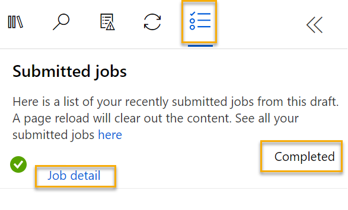

---
lab:
  title: Azure Machine Learning 디자이너를 사용하여 클러스터링 살펴보기
---

# <a name="explore-clustering-with-azure-machine-learning-designer"></a>Azure Machine Learning 디자이너를 사용하여 클러스터링 살펴보기

> **참고** 이 랩을 완료하려면 관리 액세스 권한이 있는 [Azure 구독](https://azure.microsoft.com/free?azure-portal=true)이 필요합니다.

## <a name="create-an-azure-machine-learning-workspace"></a>Azure Machine Learning 작업 영역 만들기  

1. Microsoft 자격 증명을 사용하여 [Azure Portal](https://portal.azure.com?azure-portal=true)에 로그인합니다.

1. **+ 리소스 만들기**를 선택하고, *Machine Learning*을 검색한 뒤 *Azure Machine Learning* 플랜을 사용하여 새 **Azure Machine Learning** 리소스를 만듭니다. 다음 설정을 사용합니다.
    - **구독**: *자신의 Azure 구독*.
    - **리소스 그룹**: 리소스 그룹 만들거나 선택하기
    - **작업 영역 이름**: 작업 영역의 고유한 이름 입력
    - **지역**: 지리적으로 가장 가까운 지역 선택
    - **스토리지 계정**: 작업 영역에 대해 만들 새로운 기본 스토리지 계정
    - **키 자격 증명 모음**: 작업 영역에 대해 만들 새로운 기본 키 자격 증명 모음
    - **Application insights**: 작업 영역에 대해 만들 새로운 기본 Application Insights 리소스
    - **컨테이너 레지스트리**: 없음(‘처음으로 컨테이너에 모델을 배포할 때 자동으로 만들어짐’)

1. **검토 + 생성**를 선택한 다음, **생성**를 선택합니다. 작업 영역이 만들어질 때까지 기다린 다음(몇 분 정도 걸릴 수 있음) 배포된 리소스로 이동합니다.

1. **Studio 시작**을 선택하거나 또는 새 브라우저 탭을 열고 [https://ml.azure.com](https://ml.azure.com?azure-portal=true)로 이동한 다음, Microsoft 계정을 사용하여 Azure Machine Learning 스튜디오에 로그인합니다.

1. Azure Machine Learning 스튜디오에서 새로 만든 작업 영역이 표시됩니다. 그렇지 않은 경우 왼쪽 메뉴에서 **Microsoft**를 클릭합니다. 그런 다음 새 왼쪽 메뉴에서 구독에 연결된 모든 작업 영역이 나열되는 **작업 영역**을 선택합니다. 이 연습을 위해 만든 항목을 선택합니다. 

> **참고** 이 모듈은 [Microsoft Azure AI 기본 사항: 기계 학습을 위한 시각적 도구 살펴보기](https://docs.microsoft.com/learn/paths/create-no-code-predictive-models-azure-machine-learning/) 학습 경로의 다른 모듈을 포함하여 Azure Machine Learning 작업 영역을 활용하는 여러 모듈 중 하나입니다. 고유한 Azure 구독을 사용하는 경우 작업 영역을 만든 후 다른 모듈에서 다시 사용하는 것이 좋습니다. 사용자의 구독에 Azure Machine Learning 작업 영역이 존재하는 동안에는 Azure 구독에 약간의 데이터 스토리지 요금이 청구됩니다. 따라서 더 이상 필요하지 않은 경우 Azure Machine Learning 작업 영역을 삭제하는 것이 좋습니다.

## <a name="create-compute"></a>컴퓨팅 만들기

1. [Azure Machine Learning 스튜디오](https://ml.azure.com?azure-portal=true)에서 왼쪽 위에 있는 세 줄을 선택하여 인터페이스의 다양한 페이지를 봅니다(화면 크기를 최대화해야 할 수 있음). 왼쪽 창에서 해당 페이지를 사용하여 작업 영역에서 리소스를 관리할 수 있습니다. **컴퓨팅** 페이지(**관리** 아래)를 선택합니다.

2. **컴퓨팅** 페이지에서 **컴퓨팅 클러스터** 탭을 선택하고 다음 설정으로 새 컴퓨팅 클러스터를 추가합니다. 이를 사용하여 기계 학습 모델을 학습합니다.
    - **위치**: 작업 영역과 동일한 위치를 선택합니다. 해당 위치가 나열되어 있지 않으면 가장 가까운 위치를 선택합니다.
    - **가상 머신 계층**: 전용
    - **가상 머신 유형**: CPU
    - **가상 머신 크기**:
        - **모든 옵션에서 선택** 선택
        - **Standard_DS11_v2**를 검색하고 선택
    - **다음**을 선택합니다.
    - **컴퓨팅 이름**: 고유한 이름 입력
    - **최소 노드 수**: 0
    - **최대 노드 수**: 2
    - **스케일 다운 전 유휴 시간(초)**: 120
    - **SSH 액세스 사용**: 지우기
    - **만들기**를 선택합니다.

> **참고**: 컴퓨팅 인스턴스 및 클러스터는 표준 Azure 가상 머신 이미지를 기반으로 합니다. 이 모듈에서는 비용 및 성능의 최적 균형을 달성하기 위해 *Standard_DS11_v2* 이미지를 권장합니다. 구독에 이 이미지를 포함하지 않는 할당량이 있는 경우 다른 이미지를 선택하세요. 하지만 이미지가 클수록 비용이 더 많이 들 수 있고 더 작은 이미지는 작업을 완료하기에 충분하지 않을 수 있습니다. 또는 Azure 관리자에게 할당량을 확장하도록 요청하세요.

컴퓨팅 클러스터는 만들어지는 데 시간이 좀 걸립니다. 대기하는 동안 다음 단계로 이동할 수 있습니다.

## <a name="create-a-pipeline-in-designer"></a>디자이너에서 파이프라인 만들기

Azure Machine Learning 디자이너를 시작하려면 먼저 파이프라인을 만들어야 합니다.

1. [Azure Machine Learning 스튜디오](https://ml.azure.com?azure-portal=true) 화면에서 왼쪽 위에 있는 세 줄 아이콘을 선택하여 왼쪽 창을 확장합니다. **작성자** 아래에 있는 **디자이너** 페이지를 보고 더하기 기호를 선택하여 새 파이프라인을 만듭니다.

1. 화면의 오른쪽 위에서 **설정** 선택합니다. **설정** 창이 표시되지 않으면 위쪽의 파이프라인 이름 옆에 있는 바퀴 아이콘을 선택합니다.

1. **설정**에서 파이프라인을 실행할 컴퓨팅 대상을 지정해야 합니다. **컴퓨팅 유형 선택**에서 **컴퓨팅 클러스터**를 선택합니다. 그런 다음 **Azure ML 컴퓨팅 클러스터 선택**에서 이전에 만든 컴퓨팅 클러스터를 선택합니다.

1. **설정**의 **초안 세부 정보**에서 초안 이름(**파이프라인 생성 날짜**)을 **펭귄 클러스터링 학습**으로 변경합니다.

1. **설정** 창의 오른쪽 위에 있는 닫기 아이콘을 선택하여 창을 닫은 다음, **저장**을 선택합니다.

    

## <a name="create-a-dataset"></a>데이터 세트 만들기

Azure Machine Learning에서 모델 학습 및 기타 작업의 데이터는 주로 데이터 세트라는 개체에 캡슐화됩니다. 이 모듈에서는 세 가지 종의 펭귄에 대한 관찰을 포함하는 데이터 세트를 사용합니다.

1. [Azure Machine Learning 스튜디오](https://ml.azure.com?azure-portal=true) 화면에서 왼쪽 위에 있는 세 줄을 선택하여 왼쪽 창을 확장합니다. **데이터** 페이지(**자산** 아래)를 봅니다. 데이터 페이지에는 Azure ML에서 사용할 특정 데이터 파일 또는 테이블이 있습니다. 이 페이지에서도 데이터 세트를 만들 수 있습니다.

1. **데이터** 페이지의 **데이터 자산** 탭에서 **만들기**를 선택합니다. 그런 다음, 다음 설정을 사용하여 데이터 자산을 구성합니다.
    * **데이터 형식**:
        * **이름**: penguin-data
        * **설명**: 펭귄 데이터
        * **데이터 세트 형식**: 테이블 형식
    * **데이터 원본**: 웹 파일에서
    * **웹 URL**: 
        * **웹 URL**: https://aka.ms/penguin-data
        * **데이터 유효성 검사 건너뛰기**: ‘선택하지 않습니다’.
    * **설정**:
        * **파일 형식**: 구분 기호로 분리됨
        * **구분 기호**: 쉼표
        * **인코딩**: UTF-8
        * **열 헤더**: 첫 번째 파일에만 헤더가 있음
        * **행 건너뛰기**: 없음
        * **데이터 세트에 여러 줄 데이터가 포함되어 있음**: 선택하지 마세요.
    * **스키마**:
        * **경로** 이외의 모든 열 포함
        * 자동으로 검색된 형식 검토
    * **검토**
        * **만들기**를 선택합니다.

1. 데이터 세트를 만든 후에는 이를 열고 **탐색** 페이지를 보면서 데이터 샘플을 확인합니다. 이 데이터는 여러 번 펭귄을 관찰하면서 얻은 부리 길이와 두께, 날개 길이, 무게 측정값을 나타냅니다. 데이터 세트에는 *Adelie*, *Gentoo*, *Chinstrap*의 세 가지 종의 펭귄이 표시되어 있습니다.

> **참고** 이 연습에서 사용되는 펭귄 데이터 세트는 [Kristen Gorman](https://www.uaf.edu/cfos/people/faculty/detail/kristen-gorman.php) 박사와 [Long Term Ecological Research Network](https://lternet.edu/)의 일원인 [Palmer Station, Antarctica LTER](https://pal.lternet.edu/)에서 수집 및 제공한 것입니다.

### <a name="load-data-to-canvas"></a>캔버스로 데이터 로드

1. 왼쪽 메뉴에서 **디자이너**를 선택하여 파이프라인으로 돌아갑니다. **디자이너** 페이지에서 **펭귄 클러스터링 학습**을 선택합니다.

1. 왼쪽의 파이프라인 이름 옆에 있는 화살표 아이콘을 선택하여 패널이 아직 확장되어 있지 않은 경우 확장합니다. 패널은 기본적으로 패널 맨 위에 책 아이콘으로 표시된 **자산 라이브러리** 창으로 열립니다. 자산을 찾을 수 있는 검색 창이 있습니다. **데이터** 및 **구성 요소**의 두 가지 단추가 있습니다.

    

1. **데이터**를 클릭합니다. **penguin-data** 데이터 세트를 찾아 캔버스에 배치합니다.

1. 캔버스의 **penguin-data** 데이터 세트를 오른쪽 마우스 버튼으로 클릭(Mac에서는 Ctrl+클릭)하고 **데이터 미리 보기**를 클릭합니다.

1. 데이터의 프로필 스키마를 검토하여 다양한 열의 분포를 히스토그램으로 확인할 수 있습니다. 그런 다음 **CulmenLength** 열을 선택합니다. 데이터 세트는 다음과 비슷합니다.

    

1. 데이터 세트의 특성은 다음과 같습니다.

    - 데이터 세트에는 다음 열이 포함되어 있습니다.
        - **CulmenLength**: 펭귄의 부리 길이(밀리미터)입니다.
        - **CulmenDepth**: 펭귄의 부리 깊이(밀리미터)입니다.
        - **FlipperLength**: 펭귄의 날개 길이(밀리미터)입니다.
        - **BodyMass**: 펭귄의 무게(그램)입니다.
        - **Species**: 종을 나타냅니다(0:"Amelie", 1:"Gentoo", 2:"Chinstrap").
    - **CulmenLength** 열에 누락된 값이 2개 있습니다(**CulmenDepth**, **FlipperLength** 및 **BodyMass** 열에도 누락된 값이 2개 있음).
    - 측정값은 규모가 다릅니다(수십 밀리미터에서 수천 그램까지).

1. 파이프라인 캔버스의 데이터 세트를 볼 수 있도록 데이터 세트 시각화를 닫습니다.

## <a name="apply-transformations"></a>변환 적용

1. 왼쪽의 **자산 라이브러리** 창에서 **구성 요소**를 클릭합니다. 여기에는 데이터 변환 및 모델 학습에 사용할 수 있는 다양한 모듈이 포함되어 있습니다. 검색 창을 사용해 모듈을 빠르게 찾을 수도 있습니다.

    

1. 펭귄 관찰을 클러스터링하기 위해 측정값만을 사용하고 종 열은 무시하도록 하겠습니다. 따라서 **데이터 세트에서 열 선택** 모듈을 찾아서 **penguin-data** 모듈 아래에 있는 캔버스에 배치하고 **penguin-data** 모듈 하단의 출력을 **데이터 세트에서 열 선택** 모듈 상단의 입력에 연결합니다.

    

1. **데이터 세트에서 열 선택** 모듈을 더블클릭하고 오른쪽에 있는 설정 창에서 **열 편집**을 선택합니다. 그런 다음 **열 선택** 창에서 **이름 기준**을 선택하고 **+** 링크를 사용하여 열 이름 **CulmenLength**, **CulmenDepth**, **FlipperLength** 및 **BodyMass**를 선택합니다.

    

1. **데이터 세트에서 열 선택** 모듈 설정을 닫고 디자이너 캔버스로 돌아옵니다.

1. **자산 라이브러리**에서 **누락된 데이터 정리** 모듈을 찾아서 **데이터 세트에서 열 선택** 모듈 아래에 있는 캔버스에 배치한 다음 이렇게 연결합니다.

    

1. **누락된 데이터 정리** 모듈을 더블클릭하고 오른쪽의 설정 창에서 **열 편집**을 클릭합니다. 그런 다음 **정리할 열** 창에서 **규칙 사용**을 선택하고 **모든 열**을 포함합니다.

    

1. **누락된 데이터 정리** 모듈을 선택한 상태로 설정 창에서 다음 구성을 설정합니다.
    - **최소 누락 값 비율**: 0.0
    - **최대 누락 값 비율**: 1.0
    - **정리 모드**: 전체 행 제거

1. **자산 라이브러리**에서 **데이터 정규화** 모듈을 찾아서 **누락된 데이터 정리** 모듈 아래 캔버스에 배치합니다. 그런 다음 **누락된 데이터 정리** 모듈의 가장 왼쪽에 있는 출력과 **데이터 정규화** 모듈의 입력을 연결합니다.

    

1. **데이터 정규화** 모듈을 더블클릭하고 오른쪽에 있는 창에서 **변환 메서드**를 **MinMax**로 설정하고 **열 편집**을 선택합니다. 그런 다음 **변환할 열** 창에서 **규칙 사용**을 선택하고 **모든 열**을 포함합니다.

    

1. **데이터 정규화** 모듈 설정을 닫고 디자이너 캔버스로 돌아옵니다.

## <a name="run-the-pipeline"></a>파이프라인 실행

데이터 변환을 적용하려면 파이프라인을 실험으로 실행해야 합니다.

1. **제출**을 선택하고, 컴퓨팅 클러스터에서 **mslearn-penguin-training**이라는 **새 실험**을 사용하여 파이프라인을 실행합니다.

1. 실행이 끝날 때까지 기다립니다. 5분 이상 걸릴 수 있습니다.

    

    이제 왼쪽 패널이 **제출된 작업** 창에 있습니다. 작업의 상태가 **완료**로 변경되므로 실행이 완료되는 시기를 알 수 있습니다.

## <a name="view-the-transformed-data"></a>변환된 데이터 보기

1. 실행이 완료되면 이제 모델 학습을 위해 데이터 세트가 준비됩니다. **작업 세부 정보**를 클릭합니다. 다음과 같은 모듈을 표시하는 다른 탭으로 이동됩니다.

    

1. 새 탭에서 **데이터 정규화** 모듈을 마우스 오른쪽 단추로 클릭하고 **데이터 미리 보기**를 선택한 다음, **변환된 데이터 세트**를 선택하여 결과를 봅니다.

1. 데이터를 보면 **Species** 열이 제거되어 누락된 값이 없고 4가지 모든 특징에 대한 값이 일반적인 규모로 정규화되었음을 알 수 있습니다.

1. 정규화된 데이터의 결과 시각화를 닫습니다. 이전 파이프라인 탭으로 돌아갑니다.

데이터 세트에서 사용하려는 특징을 선택 및 준비했으므로 이제 이를 사용하여 클러스터링 모델을 학습할 준비가 되었습니다.

데이터 변환을 사용하여 데이터를 준비한 후에는 이를 사용하여 기계 학습 모델을 학습할 수 있습니다.

## <a name="add-training-modules"></a>학습 모듈 추가

다음 단계를 수행하여 다음과 같이 **Train Penguin Clustering** 파이프라인을 확장합니다.


필요한 모듈을 추가하고 구성하는 동안 위 정보를 참조로 사용하여 아래의 단계를 따릅니다.

1. 아직 열려 있지 않은 경우 **Train Penguin Clustering** 파이프라인을 엽니다.

1. 왼쪽 창에 있는 **자산 라이브러리**에서 **데이터 분할** 모듈을 찾아 **데이터 정규화** 모듈의 아래에 있는 캔버스로 끌어 놓습니다. 그런 다음 **데이터 정규화** 모듈의 왼쪽 출력과 **데이터 분할** 모듈의 입력을 연결합니다.

    >**팁** 검색 창을 사용하면 모듈을 빠르게 찾을 수 있습니다. 

1. **데이터 분할** 모듈을 선택하고, 다음과 같이 설정을 구성합니다.
    * **분할 모드**: 행 분할
    * **첫 번째 출력 데이터 세트에서 행의 비율**: 0.7
    * **임의 분할**: True
    * **무작위 초기값**: 123
    * **계층화된 분할**: 아니요

1. **자산 라이브러리**에서 **클러스터링 모델 학습** 모듈을 찾아 **데이터 분할** 모듈 아래의 캔버스에 배치합니다. 그런 다음 **데이터 분할** 모듈의 결과 데이터 세트 1(왼쪽) 출력을 **클러스터링 모델 학습** 모듈의 데이터 세트(오른쪽) 입력에 연결합니다.

1. 클러스터링 모델은 원래 데이터 세트에서 선택한 모든 특징을 사용하여 데이터 항목에 클러스터를 할당해야 합니다. **클러스터링 모델 학습** 모듈을 두 번 클릭하고 오른쪽 창에서 **열 편집**을 선택합니다. **규칙 사용** 옵션을 사용하여 다음과 같이 모든 열을 포함시킵니다.

    

1. 학습 중인 모델은 특징을 사용하여 데이터를 클러스터로 그룹화하므로 클러스터링 알고리즘을 사용하여 모델을 학습해야 합니다. **자산 라이브러리**에서 **K-평균 클러스터링** 모듈을 찾아 **penguin-data** 데이터 세트의 왼쪽이자 **클러스터링 모델 학습** 모듈의 위쪽에 있는 캔버스에 배치합니다. 그런 다음 출력을 **클러스터링 모델 학습** 모듈의 **학습되지 않은 모델**(왼쪽) 입력에 연결합니다.

1. K-평균 알고리즘은 항목을 지정한 클러스터의 수, 즉 ***K*** 값으로 그룹화합니다. **K-평균 클러스터링** 모듈을 선택해 오른쪽 창에서 **중심 수** 매개 변수를 **3**으로 설정합니다.

    > **참고** 펭귄 측정값과 같은 데이터 관찰을 다차원 벡터라고 생각할 수 있습니다. K-평균은 다음과 같은 방식으로 작동합니다.
    > 1. *K* 좌표를 *n*차원 공간의 *중심*이라는 무작위로 선택된 지점으로 초기화합니다. 여기서 *n*은 특징 벡터의 차원 수입니다.
    > 2. 특징 벡터를 동일한 공간의 지점으로, 각 지점을 가장 가까운 중심에 할당합니다.
    > 3. 중심을 그에 할당된 지점의 중앙으로 이동합니다(평균 거리를 기준으로 함).
    > 4. 이동 후에 가장 가까운 중심에 지점을 다시 할당합니다.
    > 5. 클러스터 할당이 안정화되거나 지정된 반복 횟수가 완료될 때까지 3단계와 4단계를 반복합니다.

   데이터의 70%를 사용하여 클러스터링 모델을 학습한 후에는 나머지 30%를 사용하여 데이터를 클러스터에 할당하는 모델을 사용함으로써 이를 테스트할 수 있습니다.

1. **자산 라이브러리**에서 **데이터를 클러스터에 할당** 모듈을 찾아 **클러스터링 모델 학습** 모듈 아래의 캔버스에 배치합니다. 그런 다음 **클러스터링 모델 학습**의 **학습된 모델**(왼쪽) 출력을 **클러스터에 데이터 할당** 모듈의 **학습된 모델**(왼쪽) 입력에 연결합니다. 그리고 **데이터 분할** 모듈의 **결과 데이터 세트2**(오른쪽) 출력을 **클러스터에 데이터 할당** 모듈의 **데이터 세트**(오른쪽) 입력에 연결합니다.

## <a name="run-the-training-pipeline"></a>학습 파이프라인 실행

이제 학습 파이프라인을 실행하고 모델을 학습할 준비가 되었습니다.

1. 파이프라인이 다음과 같아야 합니다.

    

1. **제출**을 선택하고, 컴퓨팅 클러스터에서 **mslearn-penguin-training**이라는 기존 실험을 사용하여 파이프라인을 실행합니다.

1. 실험이 완료될 때까지 기다립니다. 5분 이상 걸릴 수 있습니다.

1. 실험 실행이 완료되면 **작업 세부 정보**를 선택합니다. 새 탭에서 **데이터를 클러스터에 할당** 모듈을 마우스 오른쪽 단추로 클릭하고 **데이터 미리 보기**를 선택한 뒤 **결과 데이터 세트**를 선택해 결과를 확인합니다.

1. 아래로 스크롤하여 각 행이 할당된 클러스터(0, 1 또는 2)를 포함하는 **할당** 열을 확인합니다. 또한 이 행을 나타내는 지점에서 각 클러스터의 중심까지의 거리를 나타내는 새 열이 있습니다. 지점과 가장 가까운 클러스터가 할당된 클러스터입니다.

1. **클러스터에 데이터 할당** 시각화를 닫습니다. 파이프라인 탭으로 돌아갑니다.

모델에서 펭귄 관찰에 대한 클러스터를 예측할 때 그 예측은 얼마나 안정적인가요? 이를 평가하려면 모델을 평가해야 합니다.

클러스터링 모델을 평가하는 것은 클러스터 할당에 대해 이전에 알려진 *true* 값이 없으므로 어렵습니다. 성공적인 클러스터링 모델은 각 클러스터의 항목 간에 적절한 수준의 분리를 제공하는 모델이므로, 해당 분리를 측정하는 데 도움이 되는 메트릭이 필요합니다.

## <a name="add-an-evaluate-model-module"></a>모델 평가 모듈 추가

1. 아직 열려 있지 않은 경우 이전 단원에서 만든 **Train Penguin Clustering** 파이프라인을 엽니다.

1. **자산 라이브러리**에서 **모델 평가** 모듈을 찾아 **데이터를 클러스터에 할당** 모듈 아래의 캔버스에 배치합니다. **데이터를 클러스터에 할당** 모듈의 출력을 **모델 평가** 모듈의 **점수가 매겨진 데이터 세트**(왼쪽) 입력에 연결합니다.

1. 파이프라인이 다음과 같아야 합니다.

    

1. **제출**을 선택하고, 기존 **mslearn-penguin-training** 실험을 사용하여 파이프라인을 실행합니다.

1. 실험이 완료될 때까지 기다립니다.

1. 실험 실행이 완료되면 **작업 세부 정보**를 선택합니다. **모델 평가** 모듈을 마우스 오른쪽 단추로 클릭하고**데이터 미리 보기**를 선택한 다음 **평가 결과**를 선택합니다. 각 행의 메트릭을 검토합니다.
    - **다른 중심까지의 평균 거리**
    - **클러스터 중심까지의 평균 거리**
    - **지점 수**
    - **클러스터 중심까지의 최대 거리**

1. **모델 평가 결과 시각화** 탭을 닫습니다.

이제 작동하는 클러스터링 모델이 있으니 이를 사용하여 새 데이터를 추론 파이프라인에 있는 클러스터에 할당할 수 있습니다.

클러스터링 모델을 학습시키기 위한 파이프라인을 만들고 실행하기 전에 유추 파이프라인을 만들 수 있습니다. 유추 파이프라인은 모델을 사용하여 클러스터에 새 데이터 관찰을 할당합니다. 이 모델이 애플리케이션에서 사용하도록 게시할 수 있는 예측 서비스의 기반을 형성합니다.

## <a name="create-an-inference-pipeline"></a>유추 파이프라인 만들기

1. Azure Machine Learning 스튜디오 화면에서 왼쪽 위에 있는 세 줄을 선택하여 왼쪽 창을 확장합니다. **작업**(**자산** 아래)을 클릭하여 실행한 모든 작업을 봅니다. 실험 **mslearn-penguin-training**을 선택한 다음, **펭귄 클러스터링 학습** 파이프라인을 선택합니다. 

1. 캔버스 위의 메뉴를 찾아 **유추 파이프라인 만들기**를 클릭합니다. 메뉴에서 **유추 파이프라인 만들기**를 찾으려면 화면을 전체 화면으로 확장하고 화면의 오른쪽 위 모서리에 있는 세 개의 점 아이콘 **...** 을 클릭해야 할 수 있습니다.  

     

1. **유추 파이프라인 만들기** 드롭다운 목록에서 **실시간 유추 파이프라인**을 클릭합니다. 몇 초 후에 **Train Penguin Clustering-real time inference**라는 새 버전의 파이프라인이 열립니다.

1. 오른쪽 위 메뉴에서 **설정**으로 이동합니다. **초안 세부 정보**에서 새 파이프라인의 이름을 **Predict Penguin Clusters**로 바꾸고 새 파이프라인을 검토합니다. 학습 파이프라인의 변환 및 클러스터링 모델이 이 파이프라인의 일부입니다. 학습된 모델은 새 데이터의 점수를 매기는 데 사용됩니다. 파이프라인에는 결과를 반환하는 웹 서비스 출력도 포함되어 있습니다. 

    유추 파이프라인을 다음과 같이 변경합니다.

    

    - 제출할 새 데이터의 **웹 서비스 입력** 구성 요소를 추가합니다.
    - **penguin-data** 데이터 세트를 **Species** 열을 포함하지 않은 **수동으로 데이터 입력** 모듈로 바꿉니다.
    - 이제는 중복되는 **데이터 세트에서 열 선택** 모듈을 제거합니다.
    - **웹 서비스 입력** 및 **수동으로 데이터 입력** 모듈(클러스터링될 데이터의 입력을 나타냄)을 **변환 적용** 모듈에 연결합니다.

    파이프라인을 수정할 때 아래의 단계를 따르고 위 이미지와 정보를 참조합니다.

1. 파이프라인에는 사용자 지정 데이터 세트에서 만든 모델에 대한 **웹 서비스 입력** 구성 요소가 자동으로 포함되지 않습니다. 자산 라이브러리에서 **웹 서비스 입력** 구성 요소를 검색하여 파이프라인의 맨 위에 배치합니다. **웹 서비스 입력** 구성 요소의 출력을 캔버스에 이미 있는 **변환 적용** 구성 요소의 오른쪽 입력에 연결합니다.  

1. 추론 파이프라인은 새 데이터가 원래 학습 데이터의 스키마와 일치하는 것으로 가정하므로 학습 파이프라인의 **penguin-data** 데이터 세트가 포함됩니다. 하지만 이 입력 데이터에는 모델에서 사용하지 않는 펭귄 종에 대한 열이 포함되어 있습니다. **penguin-data** 데이터 세트와 **데이터 세트에서 열 선택** 모듈을 모두 삭제하고 **자산 라이브러리**에 있는 **수동으로 데이터 입력** 모듈로 대체합니다. 그런 다음 **수동으로 데이터 입력** 모듈의 설정을 수정하여 다음 CSV 입력을 사용합니다. 여기에는 3개의 새로운 펭귄 관찰에 대한 특징 값이 포함되어 있습니다(헤더 포함).

    ```CSV
    CulmenLength,CulmenDepth,FlipperLength,BodyMass
    39.1,18.7,181,3750
    49.1,14.8,220,5150
    46.6,17.8,193,3800
    ```

1. **웹 서비스 입력** 및 **수동으로 데이터 입력** 모듈의 출력을 첫 번째 **변환 적용** 모듈의 데이터 세트(오른쪽) 입력에 연결합니다.

1. **모델 평가** 모듈을 삭제합니다.

1. 파이프라인이 다음 이미지와 유사한지 확인합니다.

    

1. 컴퓨팅 클러스터에서 **mslearn-penguin-inference**라는 새 실험으로 파이프라인을 제출합니다. 실험을 실행하는 데 시간이 걸릴 수 있습니다.

1. 파이프라인이 완료되면 **작업 세부 정보**를 선택합니다. 새 탭에서 **클러스터에 데이터 할당** 모듈을 마우스 오른쪽 단추로 클릭하고 **데이터 미리 보기**, **결과 데이터 세트**를 선택하여 입력 데이터의 세 가지 펭귄 관찰에 대한 예측 클러스터 할당 및 메트릭을 확인합니다.

추론 파이프라인은 특징을 기반으로 펭귄 관찰을 클러스터에 할당합니다. 이제 클라이언트 애플리케이션에서 사용할 수 있도록 파이프라인을 게시할 준비가 되었습니다.

>**참고** 이 연습에서는 ACI(Azure Container Instance)에 웹 서비스를 배포합니다. 이러한 유형의 컴퓨팅은 동적으로 만들어지며 개발 및 테스트에 유용합니다. 프로덕션 환경에서는 ‘유추 클러스터’를 만들어 향상된 스케일링 성능 및 보안을 제공하는 AKS(Azure Kubernetes Service) 클러스터를 제공해야 합니다.

## <a name="deploy-a-service"></a>서비스 배포

1. 이전 단원에서 만든 **Predict Penguin Clusters** 추론 파이프라인을 봅니다.

1. 왼쪽 창에서 **작업 세부 정보**를 선택합니다. 그러면 다른 탭이 열립니다.

    

1. 새 탭에서 **배포**를 선택합니다.

    

1. 다음 설정을 사용하여 새 실시간 엔드포인트를 배포합니다.
    -  **이름**: predict-penguin-clusters
    -  **설명**: 펭귄 클러스터
    - **컴퓨팅 형식**: Azure Container Instances

1. 웹 서비스가 배포될 때까지 기다립니다. 몇 분 정도 걸릴 수 있습니다. 

1. 배포 상태를 보려면 화면 왼쪽 위에 있는 세 줄을 선택하여 왼쪽 창을 확장합니다. **엔드포인트** 페이지(**자산** 아래)를 보고 **predict-penguin-clusters**를 선택합니다. 배포가 완료되면 **배포 상태**가 **정상**으로 변경됩니다.

## <a name="test-the-service"></a>서비스 테스트

1. **엔드포인트** 페이지에서 **predict-penguin-clusters** 실시간 엔드포인트를 열고 **테스트** 탭을 선택합니다.

    

1. 새 데이터로 모델을 테스트하는 데 사용합니다. **실시간 엔드포인트를 테스트할 입력 데이터** 아래에서 현재 데이터를 삭제합니다. 아래 데이터를 복사하여 데이터 섹션에 붙여넣습니다. 

    ```JSON
    {
        "Inputs": {
            "input1": [
                {
                    "CulmenLength": 49.1,
                    "CulmenDepth": 4.8,
                    "FlipperLength": 1220,
                    "BodyMass": 5150
                }
            ]
        },
        "GlobalParameters":  {}
    }
    ```

    > **참고** 위의 JSON은 Penguin에 대한 기능을 정의하고, 만든 **predict-penguin-clusters** 서비스를 사용하여 클러스터 할당을 예측합니다.

1. **테스트**를 선택합니다. 화면 오른쪽에 **‘Assignments’** 출력이 표시됩니다. 할당된 클러스터가 클러스터 센터에서 최단 거리에 있는 클러스터인지 확인합니다.

    

**사용** 탭의 자격 증명을 사용하여 클라이언트 애플리케이션에 연결할 준비가 된 서비스를 방금 테스트했습니다. 여기서 랩을 종료합니다. 방금 배포한 서비스를 계속 실험해 볼 수 있습니다.

## <a name="clean-up"></a>정리

만든 웹 서비스는 *Azure Container Instance*에 호스트됩니다. 추가 실험 의사가 없는 경우 불필요한 Azure 사용이 발생하지 않도록 엔드포인트를 삭제해야 합니다. 또한 다시 필요로 하기 전까지 컴퓨팅 인스턴스를 중지해야 합니다.

1. [Azure Machine Learning 스튜디오](https://ml.azure.com?azure-portal=true)의 **엔드포인트** 탭에서 **predict-penguin-clusters** 엔드포인트를 선택합니다. 그런 다음 **삭제**(&#128465;)를 선택하고 엔드포인트를 삭제하겠다고 확인합니다.

1. **컴퓨팅** 페이지의 **컴퓨팅 클러스터** 탭에서 컴퓨팅 클러스터를 선택한 다음, **삭제**를 선택합니다.

>**참고**: 컴퓨팅을 중지하면 컴퓨팅 리소스에 대한 구독 요금이 청구되지 않습니다. 그러나 구독에 Azure Machine Learning 작업 영역이 존재하는 동안에는 약간의 데이터 스토리지 요금이 청구됩니다. Azure Machine Learning 탐색을 완료했으면 Azure Machine Learning 작업 영역 및 관련 리소스를 삭제할 수 있습니다. 그러나 이 시리즈의 다른 랩을 완료하려는 경우에는 다시 만들어야 합니다.
>
> 작업 영역을 삭제하려면,
>
> 1. [Azure Portal](https://portal.azure.com?azure-portal=true)의 **리소스 그룹** 페이지에서 Azure Machine Learning 작업 영역을 만들 때 지정한 리소스 그룹을 엽니다.
> 1. **리소스 그룹 삭제**를 클릭하고 삭제하고자 하는 리소스 그룹 이름을 입력한 다음 **삭제**를 선택합니다.
