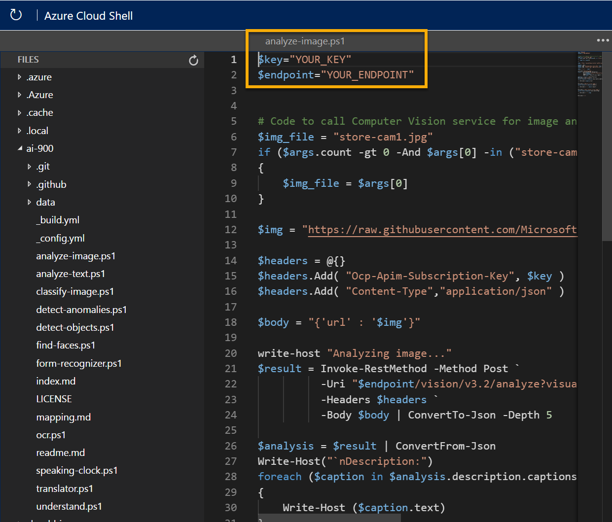

---
lab:
  title: Computer Vision 탐색
---

# Computer Vision 탐색

> **참고** 이 랩을 완료하려면 관리 액세스 권한이 있는 [Azure 구독](https://azure.microsoft.com/free?azure-portal=true)이 필요합니다.

*Computer Vision* 서비스는 미리 학습된 기계 학습 모델을 사용하여 이미지를 분석하고 이미지에 대한 정보를 추출합니다.

예를 들어 가상의 소매점인 *Northwind Traders*가 AI 서비스에서 매장을 모니터링하여 도움이 필요한 고객을 식별하고 직원에게 도움을 주도록 지시하는 "스마트 스토어"를 구현하기로 결정했다고 가정해 보겠습니다. Computer Vision 서비스를 사용하면 매장 전체의 카메라에서 촬영한 이미지를 분석하여 해당 이미지가 나타내는 내용에 대해 의미 있는 설명을 제공할 수 있습니다.

이 랩에서는 간단한 명령줄 애플리케이션을 사용하여 Computer Vision 서비스가 작동하는 모습을 확인합니다. 웹 사이트 또는 휴대폰 앱과 같은 실제 솔루션에는 동일한 원칙과 기능이 적용됩니다.

## *Azure AI 서비스* 리소스 만들기

Computer Vision 리소스 또는 **Azure AI 서비스 리소스를 **만들어 Computer Vision** 서비스를 사용할 수 있습니다**.

아직 수행하지 않은 경우 Azure 구독에서 **Azure AI 서비스 리소스를** 만듭니다.

1. 다른 브라우저 탭의 [https://portal.azure.com](https://portal.azure.com?azure-portal=true)에서 Azure Portal을 열고 Microsoft 계정을 사용하여 로그인합니다.

1. **65291을 클릭합니다. 리소스** 단추를 만들고 Azure AI 서비스를 검색*합니다*. Azure AI 서비스 계획 만들기****를** 선택합니다**. 페이지로 이동하여 Azure AI 서비스 리소스를 만듭니다. 다음 설정을 사용하여 구성합니다.
    - **구독**: *자신의 Azure 구독*.
    - **리소스 그룹**: *고유한 이름이 있는 리소스 그룹을 선택하거나 생성*합니다.
    - **지역**: 사용 가능한 지역을 선택합니다**.
    - **이름**: 고유한 이름을 입력합니다.
    - **가격 책정 계층**: 표준 S0
    - **이 확인란 선택하여 아래의 모든 약관을 읽고 이해했음을 확인**: 선택하였습니다.

1. 리소스를 검토 및 만들고 배포가 완료될 때까지 기다립니다. 그런 다음, 배포된 리소스로 이동합니다.

1. Azure AI 서비스 리소스에 **대한 키 및 엔드포인트** 페이지를 봅니다. 클라이언트 애플리케이션에서 연결하려면 엔드포인트와 키가 필요합니다.

## Cloud Shell 실행

Computer Vision 서비스의 기능을 테스트하기 위해 Azure의 Cloud Shell에서 실행되는 간단한 명령줄 애플리케이션을 사용합니다.

1. Azure Portal에서 검색 상자 오른쪽 페이지 맨 위에 있는 **[>_]**(*Cloud Shell*) 단추를 선택합니다. 그러면 포털 아래쪽에 Cloud Shell 창이 열립니다.

    

1. Cloud Shell을 처음 열면 사용할 셸 유형(*Bash* 또는 *PowerShell*)을 선택하라는 메시지가 표시될 수 있습니다. **PowerShell**을 선택합니다. 이 옵션이 표시되지 않으면 단계를 건너뜁니다.  

1. Cloud Shell에 대한 스토리지를 만들라는 메시지가 표시되면 구독이 지정되었는지 확인하고 **스토리지 만들기**를 선택합니다. 그런 다음, 스토리지가 만들어질 때까지 1분 정도 기다립니다.

    

1. Cloud Shell 창의 왼쪽 위에 표시된 셸 형식이 *PowerShell*로 전환되었는지 확인합니다. *Bash*인 경우 드롭다운 메뉴를 사용하여 *PowerShell*로 전환합니다.

    

1. PowerShell이 시작될 때까지 기다립니다. Azure Portal에 다음 화면이 표시되어야 합니다.  

    

## 클라이언트 애플리케이션 구성 및 실행

이제 Cloud Shell 환경이 생겼으므로 Computer Vision 서비스를 사용하여 이미지를 분석하는 간단한 애플리케이션을 실행할 수 있습니다.

1. 명령 셸에서 다음 명령을 입력하여 샘플 애플리케이션을 다운로드하고 ai-900이라는 폴더에 저장합니다.

    ```PowerShell
    git clone https://github.com/MicrosoftLearning/AI-900-AIFundamentals ai-900
    ```

    > **팁** 다른 랩에서 이미 이 명령을 사용하여 *ai-900* 리포지토리를 복제했다면 이 단계를 건너뛰어도 됩니다.

1. 파일은 **ai-900**이라는 폴더에 다운로드됩니다. 이제 Cloud Shell 스토리지에 있는 모든 파일을 보고 작업하려고 합니다. 셸에 다음 명령을 입력합니다.

    ```PowerShell
    code .
    ```

    그러면 아래 이미지와 같은 편집기가 열립니다.

    

1. 왼쪽의 **Files** 창에서 **ai-900**을 확장하고 **analyze-image.ps1**을 선택합니다. 이 파일에는 다음과 같이 Computer Vision 서비스를 사용하여 이미지를 분석하는 일부 코드가 포함되어 있습니다.

    

1. 코드에 대해 너무 걱정하지 마세요. 중요한 점은 엔드포인트 URL과 Azure AI 서비스 리소스에 대한 키 중 하나가 필요하다는 것입니다. Azure Portal의 리소스에 대한 **키 및 엔드포인트** 페이지에서 이러한 값을 복사하여 코드 편집기에 붙여넣고 각각 **YOUR_KEY** 및 **YOUR_ENDPOINT** 자리 표시자 값을 대체합니다.

    > **팁** **키 및 엔드포인트**와 **편집기** 창에서 작업할 때 구분줄을 사용하여 화면 영역을 조정해야 할 수도 있습니다.

    키 및 엔드포인트 값을 붙여넣은 후 코드의 처음 두 줄은 다음과 유사하게 표시됩니다.

    ```PowerShell
    $key="1a2b3c4d5e6f7g8h9i0j...."    
    $endpoint="https..."
    ```

1. 편집기 창의 오른쪽 위에서 **...** 단추를 사용하여 메뉴를 열고 **저장**을 선택하여 변경 내용을 저장합니다.

    샘플 클라이언트 애플리케이션은 Computer Vision 서비스를 사용하여 Northwind Traders 스토어의 카메라로 촬영한 다음 이미지를 분석합니다.

    

1. PowerShell 창에서 다음 명령을 입력하여 코드를 실행합니다.

    ```PowerShell
    cd ai-900
    ./analyze-image.ps1 store-camera-1.jpg
    ```

1. 다음을 포함하는 이미지 분석 결과를 검토합니다.
    - 이미지를 설명하는 제안된 캡션입니다.
    - 이미지에서 식별된 개체 목록입니다.
    - 이미지와 관련된 "태그" 목록입니다.

1. 이제 다른 이미지를 사용해 보겠습니다.

    

    두 번째 이미지를 분석하려면 다음 명령을 입력합니다.

    ```PowerShell
    ./analyze-image.ps1 store-camera-2.jpg
    ```

1. 두 번째 이미지에 대한 이미지 분석 결과를 검토합니다.

1. 한 번 더 시도해 보겠습니다.

    

    세 번째 이미지를 분석하려면 다음 명령을 입력합니다.

    ```PowerShell
    ./analyze-image.ps1 store-camera-3.jpg
    ```

1. 세 번째 이미지에 대한 이미지 분석 결과를 검토합니다.

## 자세한 정보

이 간단한 앱은 Computer Vision 서비스의 기능 중 일부만 표시합니다. 이 서비스를 사용하여 수행할 수 있는 작업을 자세히 알아보려면 [Computer Vision 페이지](https://azure.microsoft.com/products/ai-services?activetab=pivot:visiontab)를 참조하세요.
