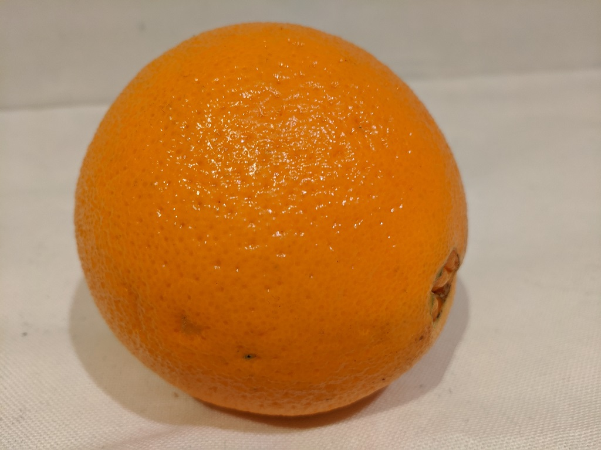

---
lab:
  title: 이미지 분류 살펴보기
  module: Module 3 - Computer Vision
---

# <a name="explore-image-classification"></a>이미지 분류 살펴보기

> **참고** 이 랩을 완료하려면 관리 액세스 권한이 있는 [Azure 구독](https://azure.microsoft.com/free?azure-portal=true)이 필요합니다.

*Computer Vision* 인지 서비스는 이미지를 사용하기 위한 미리 작성된 유용한 모델을 제공하지만 Computer Vision을 위해 자체 모델을 학습시켜야 하는 경우가 많습니다. 예를 들어 Northwind Traders 소매 기업은 체크 아웃 시 카메라에서 촬영한 이미지를 기준으로 고객이 구매할 식료품을 식별하는 자동화된 체크 아웃 시스템을 만들려고 한다고 가정합니다. 이렇게 하려면 이미지를 분류하여 구입할 품목을 식별하는 분류 모델을 학습시켜야 합니다.

Azure에서는 ***Custom Vision*** Cognitive Service를 사용하여 기존 이미지를 기준으로 이미지 분류 모델을 학습시킬 수 있습니다. 이미지 분류 솔루션을 만들기 위한 요소에는 두 가지가 있습니다. 먼저 기존 이미지를 사용하여 다른 클래스를 인식하도록 모델을 학습시켜야 합니다. 그런 다음, 모델이 학습되면 애플리케이션에서 사용할 수 있는 서비스로 게시해야 합니다.

Custom Vision 서비스의 기능을 테스트하기 위해 Cloud Shell에서 실행되는 간단한 명령줄 애플리케이션을 사용합니다. 웹 사이트 또는 휴대폰 앱과 같은 실제 솔루션에는 동일한 원칙과 기능이 적용됩니다.

## <a name="create-a-cognitive-services-resource"></a>*Cognitive Services* 리소스 만들기

**Custom Vision** 리소스 또는 **Cognitive Services** 리소스를 생성하여 Custom Vision 서비스를 사용할 수 있습니다.

>**참고** 일부 리소스는 일부 지역에서 사용할 수 없습니다. Custom Vision 리소스를 만들든 또는 Cognitive Services 리소스를 만들든 관계없이 [특정 지역](https://azure.microsoft.com/global-infrastructure/services/?products=cognitive-services)에서 만들어진 리소스만 Custom Vision 서비스에 액세스하는 데 사용할 수 있습니다. 편의상 아래 구성 지침에 지역이 미리 선택되어 있습니다.

Azure 구독에서 **Cognitive Services** 리소스를 만듭니다.

1. 다른 브라우저 탭의 [https://portal.azure.com](https://portal.azure.com?azure-portal=true)에서 Azure Portal을 열고 Microsoft 계정을 사용하여 로그인합니다.

1. **&amp;#65291; 리소스 만들기** 단추를 클릭하고, *Cognitive Services*를 검색하고, 다음 설정을 통해 **Cognitive Services** 리소스를 만듭니다.
    - **구독**: *자신의 Azure 구독*.
    - **리소스 그룹**: *고유한 이름이 있는 리소스 그룹을 선택하거나 생성*합니다.
    - **지역:** 미국 동부
    - **이름**: *고유한 이름을 입력*합니다.
    - **가격 책정 계층**: 표준 S0
    - **이 확인란 선택하여 아래의 모든 약관을 읽고 이해했음을 확인**: 선택하였습니다.

1. 리소스를 검토 및 만들고 배포가 완료될 때까지 기다립니다. 그런 다음, 배포된 리소스로 이동합니다.

1. Cognitive Services 리소스에 대한 **키 및 엔드포인트** 페이지를 봅니다. 클라이언트 애플리케이션에서 연결하려면 엔드포인트와 키가 필요합니다.

## <a name="create-a-custom-vision-project"></a>Custom Vision 프로젝트 만들기

개체 감지 모델을 학습시키려면 학습 리소스에 따라 Custom Vision 프로젝트를 만들어야 합니다. 이렇게 하려면 Custom Vision 포털을 사용합니다.

1. https://aka.ms/fruit-images에서 학습 이미지를 다운로드하고 압축을 풉니다. 이러한 이미지는 zip 폴더로 제공됩니다. 이 폴더의 압축을 풀면 **apple**, **banana** 및 **orange**라는 하위 폴더가 포함됩니다.

1. 다른 브라우저 탭에서 [https://customvision.ai](https://customvision.ai?azure-portal=true)의 Custom Vision 포털을 엽니다. 메시지가 표시되면 Azure 구독과 연결된 Microsoft 계정을 사용하여 로그인하고 서비스 약관에 동의합니다.

1. Custom Vision 포털에서 다음 설정을 사용하여 새 프로젝트를 만듭니다.

    - **이름**: 식료품 체크 아웃
    - **설명**: 식료품에 대한 이미지 분류
    - **리소스**: 이전에 만든 Custom Vision 리소스
    - **프로젝트 형식**: 분류
    - **분류 형식**: 다중 클래스(이미지당 단일 태그)
    - **도메인**: 식품

1. **이미지 추가**를 클릭하고, 앞서 압축을 해제한 **apple** 폴더에 있는 모든 파일을 선택합니다. 그런 후 다음과 같이 *apple* 태그를 지정하여 이미지 파일을 업로드합니다.

    

1. 이전 단계를 반복하여 태그 *banana*를 지정하여 **banana** 폴더에 이미지를 업로드하고 태그 *orange*를 지정하여 **orange** 폴더에 이미지를 업로드합니다.

1. Custom Vision 프로젝트에서 업로드한 이미지를 살펴봅니다. 다음과 같이 각 클래스에 15개 이미지가 있습니다.

    

1. Custom Vision 프로젝트에서 이미지 위에 있는 **학습**을 클릭하여 태그가 지정된 이미지로 분류 모델을 학습시킵니다. **빠른 학습** 옵션을 선택한 다음, 학습 반복이 완료될 때까지 기다립니다(1분 정도 걸릴 수 있음).

1. 모델 반복을 학습시킨 후에는 정밀도, 재현율 및 *AP* 성능 메트릭을 검토합니다. 이러한 메트릭은 분류 모델의 예측 정확도를 측정하며 모두 높게 나타납니다.

## <a name="test-the-model"></a>모델 테스트

애플리케이션에서 사용하려면 이 모델 반복을 게시하기 전에 테스트해야 합니다.

1. 성능 메트릭 위에 있는 **빠른 테스트**를 클릭합니다.

1. **이미지 URL** 상자에 `https://aka.ms/apple-image`를 입력하고 &#10132;를 클릭합니다.

1. 모델에서 반환된 예측 보기 - 다음과 같이 *apple*의 확률 점수가 가장 높습니다.

    

1. **빠른 테스트** 창을 닫습니다.

## <a name="publish-the-image-classification-model"></a>이미지 분류 모델 게시

이제 학습된 모델을 게시하고 클라이언트 애플리케이션에서 사용할 준비가 되었습니다.

1. **&#128504; 게시**를 클릭하여 다음 설정으로 학습된 모델을 게시합니다.
    - **모델 이름**: 식료품
    - **예측 리소스**: 이전에 만든 예측 리소스

1. 게시한 후 예측 URL(&#127760;) 아이콘을 클릭하여 게시된 모델을 사용하는 데 필요한 정보를 볼 수 있습니다. 나중에 이미지 URL에서 예측을 가져오기 위해 적절한 URL 및 Prediction-Key 값이 필요하므로 이 대화 상자를 열어 두고 다음 작업을 수행합니다. 

## <a name="run-cloud-shell"></a>Cloud Shell 실행

Custom Vision 서비스의 기능을 테스트하기 위해 Azure의 Cloud Shell에서 실행되는 간단한 명령줄 애플리케이션을 사용합니다.

1. Azure Portal에서 검색 상자 오른쪽 페이지 맨 위에 있는 **[>_]**(*Cloud Shell*) 단추를 선택합니다. 그러면 포털 아래쪽에 Cloud Shell 창이 열립니다. 

    

1. Cloud Shell을 처음 열면 사용할 셸 유형(*Bash* 또는 *PowerShell*)을 선택하라는 메시지가 표시될 수 있습니다. **PowerShell**을 선택합니다. 이 옵션이 표시되지 않으면 단계를 건너뜁니다.  

1. Cloud Shell에 대한 스토리지를 만들라는 메시지가 표시되면 구독이 지정되었는지 확인하고 **스토리지 만들기**를 선택합니다. 그런 다음, 스토리지가 만들어질 때까지 1분 정도 기다립니다.

    [](media/create-image-classification-system/powershell-portal-guide-2.png#lightbox)

1. Cloud Shell 창의 왼쪽 위에 표시된 셸 형식이 *PowerShell*로 전환되었는지 확인합니다. *Bash*인 경우 드롭다운 메뉴를 사용하여 *PowerShell*로 전환합니다.

    

1. PowerShell이 시작될 때까지 기다립니다. Azure Portal에 다음 화면이 표시되어야 합니다.  

    

## <a name="configure-and-run-a-client-application"></a>클라이언트 애플리케이션 구성 및 실행

이제 Cloud Shell 환경이 생겼으므로 Custom Vision 서비스를 사용하여 이미지를 분석하는 간단한 애플리케이션을 실행할 수 있습니다.

1. 명령 셸에서 다음 명령을 입력하여 샘플 애플리케이션을 다운로드하고 ai-900이라는 폴더에 저장합니다. 

    ```PowerShell
    git clone https://github.com/MicrosoftLearning/AI-900-AIFundamentals ai-900
    ```

    >**팁** 다른 랩에서 이미 이 명령을 사용하여 *ai-900* 리포지토리를 복제했다면 이 단계를 건너뛰어도 됩니다.

1. 파일은 **ai-900**이라는 폴더에 다운로드됩니다. 이제 Cloud Shell 스토리지에 있는 모든 파일을 보고 작업하려고 합니다. 셸에 다음 명령을 입력합니다.

    ```PowerShell
    code .
    ```

    그러면 아래 이미지와 같은 편집기가 열립니다. 

    

1. 왼쪽의 **Files** 창에서 **ai-900**을 확장하고 **classify-image.ps1**을 선택합니다. 이 파일에는 다음과 같이 Custom Vision 모델을 사용하여 이미지를 분석하는 일부 코드가 포함되어 있습니다.

     

1. 코드의 세부 사항에 대해 너무 걱정하지 마세요. 중요한 점은 이미지 URL을 사용할 때 Custom Vision 모델에 대한 예측 URL과 키가 필요하다는 것입니다. 

   Custom Vision 프로젝트의 대화 상자에서 예측 URL을 가져옵니다. 

   >**참고** 이미지 분류 모델을 게시한 후 예측 URL을 검토했습니다. 예측 URL을 찾으려면 프로젝트에서 **성능** 탭으로 이동한 다음, **예측 URL**을 클릭합니다(화면이 압축된 경우 지구본 아이콘만 표시될 수 있음). 대화 상자가 나타납니다. **이미지 URL이 있는 경우**에 대한 URL을 복사합니다. 
   >              코드 편집기에 붙여넣어. **YOUR_PREDICTION_URL**를 바꿉니다.

    동일한 대화 상자를 사용하여 *예측 키*를 가져옵니다. *Prediction-Key 헤더 설정* 이후에 표시되는 예측 키를 복사합니다. **YOUR_PREDICTION_KEY**를 자리 표시자 값으로 바꾸어 코드 편집기에 붙여넣습니다.

    

    예측 URL 및 예측 키 값을 붙여넣으면 코드의 처음 두 줄이 다음과 유사하게 표시됩니다.

    ```PowerShell
    $predictionUrl="https..."
    $predictionKey ="1a2b3c4d5e6f7g8h9i0j...."
    ```

1. 편집기 창의 오른쪽 위에서 **...** 단추를 사용하여 메뉴를 열고 **저장**을 선택하여 변경 내용을 저장합니다. 그런 다음, 메뉴를 다시 열고 **편집기 닫기**를 선택합니다.

    샘플 클라이언트 애플리케이션을 사용하여 여러 이미지를 사과, 바나나 또는 오렌지 범주로 분류합니다.

1. 이 이미지를 분류해 보겠습니다.

    

    PowerShell 창에서 다음 명령을 입력하여 코드를 실행합니다.

    ```PowerShell
    cd ai-900
    ./classify-image.ps1 1
    ```

1. **사과**를 나타내는 예측을 검토합니다.

1. 이제 다른 이미지를 사용해 보겠습니다.

    

    다음 명령을 실행합니다.

    ```PowerShell
    ./classify-image.ps1 2
    ```

1. 모델이 이 이미지를 **바나나**로 분류했는지 확인합니다.

1. 마지막으로, 세 번째 테스트 이미지를 사용해 보겠습니다.

    

    다음 명령을 실행합니다.

    ```PowerShell
    ./classify-image.ps1 3
    ```

1. 모델이 이 이미지를 **오렌지**로 분류했는지 확인합니다.

## <a name="learn-more"></a>자세한 정보

이 간단한 앱은 Custom Vision 서비스의 기능 중 일부만 표시합니다. 이 서비스를 사용하여 수행할 수 있는 작업을 자세히 알아보려면 [Custom Vision 페이지](https://azure.microsoft.com/services/cognitive-services/custom-vision-service/)를 참조하세요.
