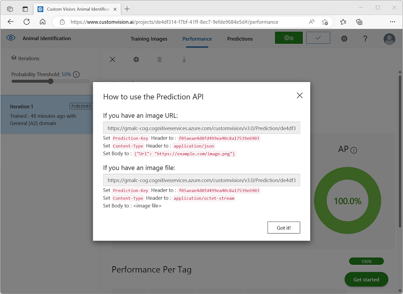

---
lab:
  title: 이미지 분류 살펴보기
---

# 이미지 분류 살펴보기

*Azure AI Vision* 서비스는 이미지 작업을 위한 유용한 미리 빌드된 모델을 제공하지만 컴퓨터 비전에 대한 고유한 모델을 학습해야 하는 경우가 많습니다. 예를 들어, 야생 동물 보호 조직이 모션에 민감한 카메라를 사용하여 동물의 목격을 추적하려고 하는 경우를 가정해 보겠습니다. 카메라에 의해 캡처 된 이미지는 특정 지역에서 특정 종의 존재를 확인하고 멸종 위기에 처한 종에 대한 보존 노력을 지원하기 위해 사용할 수 있습니다. 이를 위해 조직은 캡처된 *사진에서 다양한 종의 동물을 식별하도록 학습된 이미지 분류* 모델을 활용할 수 있습니다.

Azure에서 Custom Vision*** 서비스를 사용하여 ***기존 이미지를 기반으로 이미지 분류 모델을 학습할 수 있습니다. 이미지 분류 솔루션을 만들기 위한 요소에는 두 가지가 있습니다. 먼저 기존 이미지를 사용하여 다른 클래스를 인식하도록 모델을 학습시켜야 합니다. 그런 다음, 모델이 학습되면 애플리케이션에서 사용할 수 있는 서비스로 게시해야 합니다.

Custom Vision 서비스의 기능을 테스트하기 위해 Cloud Shell에서 실행되는 간단한 명령줄 애플리케이션을 사용합니다. 동일한 원칙과 기능이 웹 사이트 또는 모바일 앱과 같은 실제 솔루션에 적용됩니다.

## 시작하기 전에

이 랩을 완료하려면 관리 액세스 권한이 있는 [Azure 구독](https://azure.microsoft.com/free?azure-portal=true)이 필요합니다.

## *Azure AI 서비스* 리소스 만들기

Custom Vision 리소스 또는 **Azure AI 서비스 리소스를 **만들어 Custom Vision** 서비스를 사용할 수 있습니다**.

>**참고** 일부 리소스는 일부 지역에서 사용할 수 없습니다. Custom Vision 또는 Azure AI 서비스 리소스를 만들든 특정 지역에서 [](https://azure.microsoft.com/global-infrastructure/services/?products=cognitive-services) 만든 리소스만 Custom Vision 서비스에 액세스하는 데 사용할 수 있습니다. 편의상 아래 구성 지침에 지역이 미리 선택되어 있습니다.

Azure 구독에서 **Azure AI 서비스** 리소스를 만듭니다.

1. [https://portal.azure.com](https://portal.azure.com?azure-portal=true)에서 Azure Portal을 열고 Microsoft 계정을 사용하여 로그인합니다.

1. **65291을 클릭합니다. 리소스** 단추를 만들고 Azure AI 서비스를 검색*합니다*. Azure AI 서비스 계획 만들기****를** 선택합니다**. 페이지로 이동하여 Azure AI 서비스 리소스를 만듭니다. 다음 설정을 사용하여 구성합니다.
    - **구독**: *자신의 Azure 구독*.
    - **리소스 그룹**: *고유한 이름이 있는 리소스 그룹을 선택하거나 생성*합니다.
    - **지역:** 미국 동부
    - **이름**: 고유한 이름을 입력합니다.
    - **가격 책정 계층**: 표준 S0
    - **이 확인란 선택하여 아래의 모든 약관을 읽고 이해했음을 확인**: 선택하였습니다.

1. 리소스를 검토 및 만들고 배포가 완료될 때까지 기다립니다. 그런 다음, 배포된 리소스로 이동합니다.

1. Azure AI 서비스 리소스에 **대한 키 및 엔드포인트** 페이지를 봅니다. 클라이언트 애플리케이션에서 연결하려면 엔드포인트와 키가 필요합니다.

## Custom Vision 프로젝트 만들기

개체 감지 모델을 학습시키려면 학습 리소스에 따라 Custom Vision 프로젝트를 만들어야 합니다. 이렇게 하려면 Custom Vision 포털을 사용합니다.

1. [https://aka.ms/animal-images](https://aka.ms/animal-images)에서 학습 이미지를 다운로드하고 압축을 풉니다. 이러한 이미지는 압축된 폴더에 제공되며 압축을 풀면 코끼리 **, **기린** 및 **사자**라는 **하위 폴더가 포함됩니다.

1. 새 브라우저 탭을 열고 .에서 [https://customvision.ai](https://customvision.ai?azure-portal=true)Custom Vision 포털로 이동합니다. 메시지가 표시되면 Azure 구독과 연결된 Microsoft 계정을 사용하여 로그인하고 서비스 약관에 동의합니다.

1. Custom Vision 포털에서 다음 설정을 사용하여 새 프로젝트를 만듭니다.

    - **이름**: 동물 식별
    - **설명**: 동물에 대한 이미지 분류
    - **리소스**: *이전에 만든 Azure AI 서비스 또는 Custom Vision 리소스*
    - **프로젝트 형식**: 분류
    - **분류 형식**: 다중 클래스(이미지당 단일 태그)
    - **Do기본s**: General \[A2]

1. 이미지** 추가를 클릭하고 **이전에 추출한 코끼리** 폴더의 **모든 파일을 선택합니다. 그런 다음, 다음과 같이 태그 *코끼리*를 지정하여 이미지 파일을 업로드합니다.

    

1. 이미지 추가([+]) 단추를 사용하여 기린** 폴더에 태그 *기린*이 있는 **이미지를 업로드하고 사자** 폴더에 태그 *사자*가 있는 **이미지를 업로드합니다.** ** 

1. Custom Vision 프로젝트에서 업로드한 이미지를 탐색합니다. 다음과 같이 각 클래스의 이미지가 17개 있어야 합니다.

    

1. Custom Vision 프로젝트에서 이미지 위에 있는 **학습**을 클릭하여 태그가 지정된 이미지로 분류 모델을 학습시킵니다. **빠른 학습** 옵션을 선택한 다음 학습 반복이 완료되기를 기다립니다.

    > **팁**: 교육은 몇 분 정도 걸릴 수 있습니다. 기다리는 동안 눈 표범 셀카와 AI가 멸종에서[ 종을 구하는 데 어떻게 도움이 될 수 있는지 검사 ](https://news.microsoft.com/transform/snow-leopard-selfies-ai-save-species/)컴퓨터 비전을 사용하여 야생에서 멸종 위기에 처한 동물을 추적하는 실제 프로젝트를 설명합니다.

1. 모델 반복이 학습되면 정밀도, *재현*율* 및 *AP* 성능 메트릭을 검토*합니다. 이러한 메트릭은 분류 모델의 예측 정확도를 측정하며 모두 높아야 합니다.

## 모델 테스트

애플리케이션에서 사용하려면 이 모델 반복을 게시하기 전에 테스트해야 합니다.

1. 성능 메트릭 위에 있는 **빠른 테스트**를 클릭합니다.

1. 이미지 URL** 상자에 빠른 테스트 이미지(&#10132;)** 단추를 입력 `https://aka.ms/giraffe` 하고 클릭합니다**.**

1. 모델에서 반환된 예측을 확인합니다. 기린*의 확률 점수*는 다음과 같이 가장 높아야 합니다.

    

1. **빠른 테스트** 창을 닫습니다.

## 이미지 분류 모델 게시

이제 학습된 모델을 게시하고 클라이언트 애플리케이션에서 사용할 준비가 되었습니다.

1. **&#128504; 게시**를 클릭하여 다음 설정으로 학습된 모델을 게시합니다.
    - **모델 이름**: 동물
    - **예측 리소스**: *이전에* 만든 Azure AI 서비스 또는 Custom Vision 예측 리소스입니다.

1. 게시한 후 예측 URL *(&#127760;) 아이콘을 클릭하여 *게시된 모델을 사용하는 데 필요한 정보를 확인합니다.

    

나중에 이미지 URL에서 예측을 가져오기 위해 적절한 URL 및 Prediction-Key 값이 필요하므로 이 대화 상자를 열어 두고 다음 작업을 수행합니다.

## 클라이언트 애플리케이션 준비

Custom Vision 서비스의 기능을 테스트하기 위해 Azure의 클라우드 셸에서 실행되는 간단한 명령줄 애플리케이션을 사용합니다.

1. Azure Portal이 포함된 브라우저 탭으로 다시 전환하고 검색 상자 오른쪽에 있는 페이지 맨 위에 있는 Cloud Shell(**[>_]**) 단추를 선택합니다 **.** 그러면 포털 아래쪽에 클라우드 셸 창이 열립니다.

    Cloud Shell을 처음 열면 사용할 셸 유형(*Bash* 또는 *PowerShell*)을 선택하라는 메시지가 표시될 수 있습니다. 그렇다면 PowerShell**을 선택합니다**.

    Cloud Shell에 대한 스토리지를 만들라는 메시지가 표시되면 구독이 선택되어 있는지 확인하고 스토리지** 만들기를 선택합니다**. 그런 다음, 스토리지가 만들어질 때까지 1분 정도 기다립니다.

    클라우드 셸이 준비되면 다음과 유사하게 표시됩니다.
    
    

    > **팁**: Cloud Shell 창의 왼쪽 위에 표시된 셸 유형이 PowerShell*인지 *확인합니다. *Bash*인 경우 드롭다운 메뉴를 사용하여 *PowerShell*로 전환합니다.

    창 맨 위에 있는 구분 기호 막대를 끌거나 창 오른쪽 위에 있는 **&#8212;** , **&#9723;** 및 **X** 아이콘을 사용하여 Cloud Shell 크기를 조정하여 창을 최소화, 최대화하고 닫을 수 있습니다. Azure Cloud Shell 사용에 관한 자세한 내용은 [Azure Cloud Shell 설명서](https://docs.microsoft.com/azure/cloud-shell/overview)를 참조하세요.

2. 명령 셸에서 다음 명령을 입력하여 이 연습의 파일을 다운로드하고 ai-900**이라는 **폴더에 저장합니다(이미 있는 경우 해당 폴더를 제거한 후).

    ```PowerShell
    rm -r ai-900 -f
    git clone https://github.com/MicrosoftLearning/AI-900-AIFundamentals ai-900
    ```

3. 파일을 다운로드한 후 다음 명령을 입력하여 ai-900** 디렉터리로 **변경하고 이 연습의 코드 파일을 편집합니다.

    ```PowerShell
    cd ai-900
    code classify-image.ps1
    ```

    이렇게 하면 아래 이미지의 편집기처럼 편집기가 열립니다.

     

     > **팁**: 클라우드 셸 명령줄과 코드 편집기 사이에 구분 기호 막대를 사용하여 창의 크기를 조정할 수 있습니다.

4. 코드의 세부 정보에 대해 너무 걱정하지 마세요. 중요한 점은 Custom Vision 모델에 대한 예측 URL 및 키를 지정하는 일부 코드로 시작한다는 것입니다. 나머지 코드에서 모델을 사용하도록 업데이트해야 합니다.

    *Custom Vision 프로젝트의 브라우저 탭에서 열어 놓은 대화 상자에서 예측 URL* 및 *예측 키를* 가져옵니다. **이미지 URL*이 있는 경우 버전을 사용해야 *합니다.**

    이러한 값을 사용하여 코드 파일의 **YOUR_PREDICTION_URL** 및 **YOUR_PREDICTION_KEY** 자리 표시자를 바꿉니다.

    예측 URL 및 예측 키 값을 붙여넣으면 코드의 처음 두 줄이 다음과 유사하게 표시됩니다.

    ```PowerShell
    $predictionUrl="https..."
    $predictionKey ="1a2b3c4d5e6f7g8h9i0j...."
    ```

5. 코드에서 변수를 변경한 후 Ctrl+S**를 눌러 **파일을 저장합니다. 그런 다음 Ctrl+Q**를 눌러 **코드 편집기를 닫습니다.

## 클라이언트 애플리케이션 테스트

이제 샘플 클라이언트 애플리케이션을 사용하여 포함된 동물에 따라 이미지를 분류할 수 있습니다.

1. PowerShell 창에서 다음 명령을 입력하여 코드를 실행합니다.

    ```PowerShell
    ./classify-image.ps1 1
    ```

    이 코드는 모델을 사용하여 다음 이미지를 분류합니다.

    

1. 기린**이어야 하는 예측을 검토합니다**.

1. 이제 다른 이미지를 사용해 보겠습니다. 다음 명령을 실행합니다.

    ```PowerShell
    ./classify-image.ps1 2
    ```

    이번에는 다음 이미지가 분류됩니다.

    

1. 모델이 이 이미지를 코끼리**로 **분류했는지 확인합니다.

1. 한 번 더 시도해 보겠습니다. 다음 명령을 실행합니다.

    ```PowerShell
    ./classify-image.ps1 3
    ```

    최종 이미지는 다음과 같습니다.

    

1. 모델이 이 이미지를 사자**로 **분류했는지 확인합니다.

이미지 분류 모델이 세 개의 이미지를 모두 올바르게 분류할 수 있기를 바랍니다.


