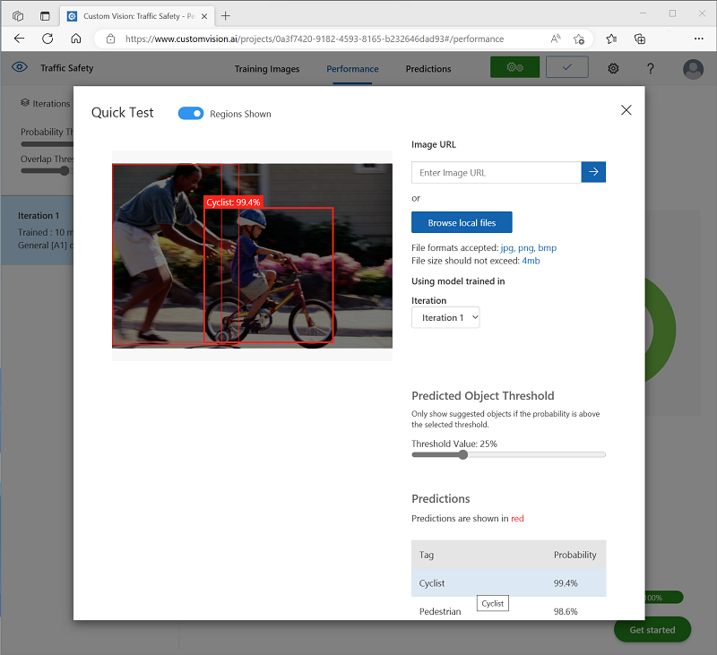

---
lab:
  title: 개체 감지 살펴보기
---

# 개체 감지 살펴보기

> **참고** 이 랩을 완료하려면 관리 액세스 권한이 있는 [Azure 구독](https://azure.microsoft.com/free?azure-portal=true)이 필요합니다.

개체 감지는 이미지에 있는 개체의 개별 인스턴스를 분류하고, 해당 위치를 표시하는 경계 상자를 나타내도록 기계 학습 모델을 학습시키는 Computer Vision의 한 형태입니다. 이를 이미지 분류(모델이 “이것이 무슨 이미지인가요?”라는 질문에 답변함)에서 모델에 “이 이미지에 있는 개체는 무엇이며, 어디에 있나요?”라고 질문할 수 있는 솔루션 빌드에 이르는 진행 과정으로 생각할 수 있습니다.

예를 들어 도로 안전 이니셔티브는 보행자와 자전거를 교통 교차로에서 가장 취약한 도로 사용자로 식별할 수 있습니다. 카메라를 사용하여 교차로를 모니터링함으로써 도로 사용자의 이미지를 분석하여 보행자와 자전거를 감지하여 숫자를 모니터링하거나 교통 신호의 동작을 변경할 수 있습니다.

Microsoft Azure의 **Custom Vision** Cognitive Service는 사용자 지정 개체 감지 모델을 만들고 게시하기 위한 클라우드 기반 솔루션을 제공합니다. Azure에서는 Custom Vision 서비스를 사용하여 기존 이미지를 기반으로 개체 검색 모델을 학습시킬 수 있습니다. 개체 감지 솔루션을 만드는 데는 두 가지 요소가 있습니다. 먼저 레이블이 지정된 이미지를 사용하여 개체의 위치 및 클래스를 감지하도록 모델을 학습시켜야 합니다. 그런 다음, 모델이 학습되면 애플리케이션에서 사용할 수 있는 서비스로 게시해야 합니다.

Custom Vision 서비스의 기능을 테스트하여 이미지의 개체를 감지하려면 Cloud Shell에서 실행되는 간단한 명령줄 애플리케이션을 사용합니다. 동일한 원칙과 기능이 웹 사이트 또는 모바일 앱과 같은 실제 솔루션에 적용됩니다.

## *Cognitive Services* 리소스 만들기

**Custom Vision** 리소스 또는 **Cognitive Services** 리소스를 생성하여 Custom Vision 서비스를 사용할 수 있습니다.

> **참고** 일부 리소스는 일부 지역에서 사용할 수 없습니다. Custom Vision 리소스를 만들든 또는 Cognitive Services 리소스를 만들든 관계없이 [특정 지역](https://azure.microsoft.com/global-infrastructure/services/?products=cognitive-services)에서 만들어진 리소스만 Custom Vision 서비스에 액세스하는 데 사용할 수 있습니다. 편의상 아래 구성 지침에 지역이 미리 선택되어 있습니다.

Azure 구독에서 **Cognitive Services** 리소스를 만듭니다.

1. 다른 브라우저 탭의 [https://portal.azure.com](https://portal.azure.com?azure-portal=true)에서 Azure Portal을 열고 Microsoft 계정을 사용하여 로그인합니다.

1. **&amp;#65291; 리소스 만들기** 단추를 클릭하고, *Cognitive Services*를 검색하고, 다음 설정을 통해 **Cognitive Services** 리소스를 만듭니다.
    - **구독**: *자신의 Azure 구독*.
    - **리소스 그룹**: *고유한 이름이 있는 리소스 그룹을 선택하거나 생성*합니다.
    - **지역:** 미국 동부
    - **이름**: *고유한 이름을 입력*합니다.
    - **가격 책정 계층**: 표준 S0
    - **이 확인란 선택하여 아래의 모든 약관을 읽고 이해했음을 확인**: 선택하였습니다.

1. 리소스를 검토 및 만들고 배포가 완료될 때까지 기다립니다. 그런 다음, 배포된 리소스로 이동합니다.

1. Cognitive Services 리소스에 대한 **키 및 엔드포인트** 페이지를 봅니다. 클라이언트 애플리케이션에서 연결하려면 엔드포인트와 키가 필요합니다.

## Custom Vision 프로젝트 만들기

개체 감지 모델을 학습시키려면 학습 리소스에 따라 Custom Vision 프로젝트를 만들어야 합니다. 이렇게 하려면 Custom Vision 포털을 사용합니다.

1. 새 브라우저 탭에서 [https://customvision.ai](https://customvision.ai?azure-portal=true)의 Custom Vision 포털을 열고 Azure 구독과 연관된 Microsoft 계정을 사용하여 로그인합니다.

1. 다음 설정을 사용하여 새 프로젝트를 만듭니다.
    - **이름**: 교통 안전
    - **설명**: 도로 안전을 위한 개체 감지.
    - **리소스**: 이전에 만든 리소스
    - **프로젝트 형식**: 개체 감지
    - **도메인**: 일반 \[A1]

1. 프로젝트가 만들어지고 브라우저에서 열릴 때까지 기다립니다.

## 이미지 추가 및 태그 지정

개체 감지 모델을 학습시키려면 모델이 식별할 클래스가 포함된 이미지를 업로드하고, 태그를 지정하여 각 개체 인스턴스에 대한 경계 상자를 나타내야 합니다.

1. 에서 [https://aka.ms/traffic-images](https://aka.ms/traffic-images)학습 이미지를 다운로드하고 추출합니다. 추출된 폴더에는 자전거 운전자와 보행자의 이미지 컬렉션이 포함되어 있습니다.

1. Custom Vision 포털의 **Traffic Safety** 개체 검색 프로젝트에서 **이미지 추가**를 선택하고 추출된 폴더에 모든 이미지를 업로드합니다.

    

1. 이미지를 업로드한 후 첫 번째 이미지를 선택하여 엽니다.

1. 자동으로 검색된 영역이 표시될 때까지 이미지의 모든 개체(자전거 또는 보행자)에 마우스를 놓습니다. 그런 다음, 개체를 선택하고 필요한 경우 영역의 크기를 조정하여 개체를 둘러싸도록 합니다. 또는 단순히 개체를 주변을 끌어 영역을 만들 수 있습니다.

    사각형 영역 내에서 개체를 단단히 선택하면 개체에 적절한 태그(*자전거* 또는 *보행자*)를 입력하고 **태그 영역** (**+**) 단추를 사용하여 프로젝트에 태그를 추가합니다.

    

1. 오른쪽의 **다음** (**>)** 링크를 사용하여 다음 이미지로 이동하고 해당 개체에 태그를 지정합니다. 그런 다음 전체 이미지 컬렉션을 계속 작업하고 각 자전거 타는 사람 및 보행자에게 태그를 지정합니다.

    이미지에 태그를 지정할 때 다음 사항에 유의하세요.

    - 일부 이미지에는 여러 개체가 포함되어 있으며, 잠재적으로 형식이 다를 수 있습니다. 겹치는 경우에도 각 태그에 태그를 지정합니다.
    - 태그를 한 번 입력한 후에는 새 개체에 태그를 지정할 때 목록에서 태그를 선택할 수 있습니다.
    - 이미지를 앞뒤로 이동하여 태그를 조정할 수 있습니다.

    

1. 마지막 이미지에 태그를 지정했으면 **이미지 세부 정보** 편집기를 닫고 **학습 이미지** 페이지의 **태그** 아래에서 **태그가 지정됨**을 선택하여 태그가 지정된 이미지를 모두 확인합니다.

    

## 모델 학습 및 테스트

프로젝트의 이미지에 태그를 지정했으므로 이제 모델을 학습시킬 준비가 되었습니다.

1. Custom Vision 프로젝트에서 **학습**을 클릭하여 태그가 지정된 이미지로 개체 감지 모델을 학습시킵니다. **빠른 학습** 옵션을 선택합니다.

    > **팁**: 교육은 몇 분 정도 걸릴 수 있습니다. 기다리는 동안 도로 안전 개선 이니셔티브에서 컴퓨터 비전을 사용하는 실제 프로젝트를 설명하는 [스마트 도시를 위한 비디오 분석을](https://www.microsoft.com/research/video/video-analytics-for-smart-cities/) 검사.

2. 학습이 완료되면 *정밀도*, *재현율* 및 *mAP* 성능 메트릭을 검토합니다. 이러한 메트릭은 개체 감지 모델의 예측 성능을 측정하며 모두 합리적으로 높아야 합니다.

3. 왼쪽에서 **확률 임계값** 을 조정하여 50%에서 90%로 늘리고 성능 메트릭에 미치는 영향을 관찰합니다. 이 설정은 각 태그 평가가 예측으로 계산되기 위해 충족하거나 초과해야 하는 확률 값을 결정합니다.

    

4. 페이지 오른쪽 위에서 **빠른 테스트를** 클릭한 다음 **이미지 URL** 상자에서 결과를 입력 `https://aka.ms/pedestrian-cyclist` 하고 확인합니다.

    오른쪽 창의 **예측**에서 검색된 각 개체는 태그와 확률로 나열됩니다. 각 개체를 선택하여 이미지에서 강조 표시된 것을 확인합니다.

    예측된 물체가 모두 올바르지 않을 수도 있습니다 - 결국 자전거와 보행자는 많은 공통 기능을 공유합니다. 모델이 가장 신뢰하는 예측은 확률 값이 가장 높습니다. **임계값** 슬라이더를 사용하여 확률이 낮은 개체를 제거합니다. 올바른 예측만 포함되는 지점을 찾을 수 있어야 합니다(아마도 약 85~90%).

    

5. 그런 다음, **빠른 테스트** 창을 닫습니다.

## 개체 감지 모델 게시

이제 학습된 모델을 게시하고 클라이언트 애플리케이션에서 사용할 준비가 되었습니다.

1. **&#128504; 게시**를 클릭하여 다음 설정으로 학습된 모델을 게시합니다.
    - **모델 이름**: 트래픽 안전
    - **예측 리소스**: 이전에 만든 리소스

1. 게시한 후 예측 URL(&#127760;) 아이콘을 클릭하여 게시된 모델을 사용하는 데 필요한 정보를 볼 수 있습니다.

    

나중에 이미지 URL에서 예측을 가져오기 위해 적절한 URL 및 Prediction-Key 값이 필요하므로 이 대화 상자를 열어 두고 다음 작업을 수행합니다.

## 클라이언트 애플리케이션 준비

Custom Vision 서비스의 기능을 테스트하기 위해 Azure의 클라우드 셸에서 실행되는 간단한 명령줄 애플리케이션을 사용합니다.

1. Azure Portal 포함된 브라우저 탭으로 다시 전환하고 검색 상자 오른쪽에 있는 페이지 맨 위에 있는 **Cloud Shell**(**[>_]**) 단추를 선택합니다. 그러면 포털 아래쪽에 클라우드 셸 창이 열립니다.

    Cloud Shell을 처음 열면 사용할 셸 유형(*Bash* 또는 *PowerShell*)을 선택하라는 메시지가 표시될 수 있습니다. 그렇다면 **PowerShell**을 선택합니다.

    Cloud Shell 대한 스토리지를 만들라는 메시지가 표시되면 구독이 선택되어 있는지 확인하고 **스토리지 만들기**를 선택합니다. 그런 다음, 스토리지가 만들어질 때까지 1분 정도 기다립니다.

    클라우드 셸이 준비되면 다음과 유사하게 표시됩니다.
    
    

    > **팁**: Cloud Shell 창의 왼쪽 위에 표시된 셸 유형이 *PowerShell*인지 확인합니다. *Bash*인 경우 드롭다운 메뉴를 사용하여 *PowerShell*로 전환합니다.

    창 맨 위에 있는 구분 기호 막대를 끌거나 창 오른쪽 위에 있는 **&#8212;** , **&#9723;** 및 **X** 아이콘을 사용하여 Cloud Shell 크기를 조정하여 창을 최소화, 최대화하고 닫을 수 있습니다. Azure Cloud Shell 사용에 관한 자세한 내용은 [Azure Cloud Shell 설명서](https://docs.microsoft.com/azure/cloud-shell/overview)를 참조하세요.

2. 명령 셸에서 다음 명령을 입력하여 이 연습의 파일을 다운로드하고 **ai-900** 이라는 폴더에 저장합니다(이미 있는 경우 해당 폴더를 제거한 후).

    ```PowerShell
    rm -r ai-900 -f
    git clone https://github.com/MicrosoftLearning/AI-900-AIFundamentals ai-900
    ```

3. 파일을 다운로드한 후 다음 명령을 입력하여 **ai-900** 디렉터리로 변경하고 이 연습의 코드 파일을 편집합니다.

    ```PowerShell
    cd ai-900
    code detect-objects.ps1
    ```

    이렇게 하면 아래 이미지와 같은 편집기가 열립니다.

     

     > **팁**: 클라우드 셸 명령줄과 코드 편집기 사이에 구분 기호 막대를 사용하여 창의 크기를 조정할 수 있습니다.

4. 코드의 세부 정보에 대해 너무 걱정하지 마세요. 중요한 점은 Custom Vision 모델의 예측 URL과 키를 지정하는 일부 코드로 시작된다는 것입니다. 나머지 코드에서 모델을 사용하도록 업데이트해야 합니다.

    Custom Vision 프로젝트의 브라우저 탭에서 열어 놓은 대화 상자에서 *예측 URL* 및 *예측 키를* 가져옵니다. *이미지 URL*이 있는 경우 버전을 사용해야 합니다.

    이러한 값을 사용하여 코드 파일의 **YOUR_PREDICTION_URL** 및 **YOUR_PREDICTION_KEY** 자리 표시자를 바꿉니다.

    예측 URL 및 예측 키 값을 붙여넣으면 코드의 처음 두 줄이 다음과 유사하게 표시됩니다.

    ```PowerShell
    $predictionUrl="https..."
    $predictionKey ="1a2b3c4d5e6f7g8h9i0j...."
    ```

5. 코드에서 변수를 변경한 후 **Ctrl+S** 를 눌러 파일을 저장합니다. 그런 다음 **Ctrl+Q** 를 눌러 코드 편집기를 닫습니다.

## 클라이언트 애플리케이션 이름

이제 샘플 클라이언트 애플리케이션을 사용하여 이미지에서 자전거 운전자와 보행자를 감지할 수 있습니다.

1. PowerShell 창에서 다음 명령을 입력하여 코드를 실행합니다.

    ```PowerShell
    ./detect-objects.ps1 1
    ```

    이 코드는 모델을 사용하여 다음 이미지의 개체를 검색합니다.

    

1. 해당 위치 주변의 경계 상자 좌표와 함께 90% 이상의 확률로 검색된 개체를 나열하는 예측을 검토합니다.

1. 이제 다른 이미지를 사용해 보겠습니다. 다음 명령을 실행합니다.

    ```PowerShell
    ./detect-objects.ps1 2
    ```

    이번에는 다음 이미지를 분석합니다.

    

개체 감지 모델이 테스트 이미지에서 보행자와 자전거를 감지하는 데 좋은 역할을 했으면 합니다.

## 자세한 정보

이 연습에서는 Custom Vision 서비스의 기능 중 일부만 보여줍니다. 이 서비스를 사용하여 수행할 수 있는 작업을 자세히 알아보려면 [Custom Vision 페이지](https://azure.microsoft.com/services/cognitive-services/custom-vision-service/)를 참조하세요.
