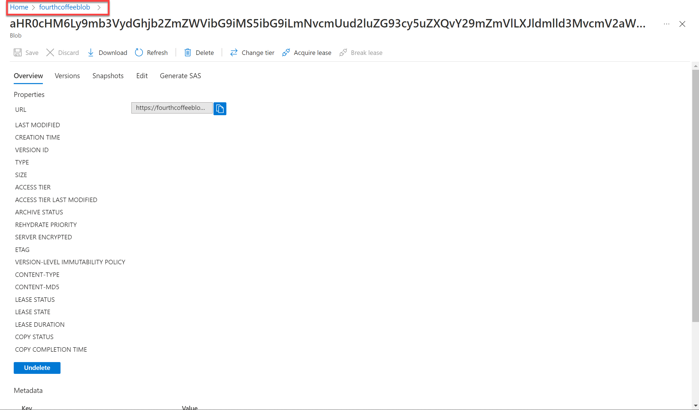

---
lab:
  title: 지식 마이닝 살펴보기
  module: Module 5 - Conversational AI
---

# 지식 마이닝 살펴보기

> **참고** 이 랩을 완료하려면 관리 액세스 권한이 있는 [Azure 구독](https://azure.microsoft.com/free?azure-portal=true)이 필요합니다.

전국적인 커피 체인인 Fourth Coffee에서 일한다고 가정해 보겠습니다. 고객 환경에 대한 인사이트를 쉽게 검색할 수 있는 지식 마이닝 솔루션을 빌드하는 데 도움을 달라는 요청을 받았습니다. 고객 리뷰에서 추출한 데이터를 사용하여 Azure Cognitive Search 인덱스를 빌드하기로 결정했습니다.  

이 랩에서는 다음을 수행합니다.

- Azure 리소스 만들기
- 데이터 원본에서 데이터 추출
- AI 기술을 사용하여 데이터 보강
- Azure Portal에서 Azure 인덱서 사용
- 검색 인덱스 쿼리
- 지식 저장소에 저장된 결과 검토

## Azure 리소스 필요

Fourth Coffee를 위해 만들 솔루션에는 Azure 구독의 다음 리소스가 필요합니다.

- 인덱싱 및 쿼리를 관리하는 **Azure Cognitive Search** 리소스.
- **Cognitive Services** 리소스는 검색 솔루션이 AI 생성 인사이트로 데이터 소스의 데이터를 보강하는 데 사용할 수 있는 기술에 대한 AI 서비스를 제공합니다.

    > **참고** Azure Cognitive Search 및 Cognitive Services 리소스는 동일한 위치에 있어야 합니다.

- Blob 컨테이너가 있는 **스토리지 계정**으로, 원시 문서와 기타 테이블, 개체 또는 파일 컬렉션을 저장합니다.

### *Azure Cognitive Search* 리소스 만들기

1. 로그인은 [Azure 포털](https://portal.azure.com/learn.docs.microsoft.com?azure-portal=true)합니다.

1. **＋ 리소스 만들기** 단추를 클릭하고, *Azure Cognitive Search*를 검색하고, 다음 설정을 통해 **Azure Cognitive Search** 리소스를 만듭니다.

    - **구독**: *자신의 Azure 구독*.
    - **리소스 그룹**: *고유한 이름이 있는 리소스 그룹을 선택하거나 생성*합니다.
    - **서비스 이름**: 고유 이름
    - **위치**: 사용 가능한 지역 선택
    - **가격 책정 계층**: 기본

1. **검토 + 만들기**를 선택하고 **유효성 검사 성공**이라는 응답이 표시되면 **만들기**를 선택합니다.

1. 배포가 완료되면 **리소스로 이동**을 선택합니다. Azure Cognitive Search 개요 페이지에서 인덱스를 추가하고, 데이터를 가져오고, 만든 인덱스를 검색할 수 있습니다.

### Cognitive Services 리소스 만들기

Azure Cognitive Search 리소스와 동일한 위치에 있는 **Cognitive Services** 리소스를 프로비전해야 합니다. 검색 솔루션은 이 리소스를 사용하여 AI에서 생성된 인사이트를 사용하여 데이터 저장소의 데이터를 보강합니다.

1. Azure Portal의 홈페이지로 돌아가서 **＋ 리소스 만들기** 단추를 선택하고 *Cognitive Services*를 검색한 후, 다음 설정을 사용하여 **Cognitive Services** 리소스를 만듭니다. 
    - **구독**: *자신의 Azure 구독*.
    - **리소스 그룹**: Azure Cognitive Search 리소스와 동일한 리소스 그룹
    - **지역**: Azure Cognitive Search 리소스와 동일한 지역
    - **이름**: 고유 이름
    - **가격 책정 계층**: 표준 S0
    - **이 확인란 선택하여 아래의 모든 약관을 읽고 이해했음을 확인**: 선택하였습니다.

1. **검토 + 만들기**를 선택합니다. 응답 **유효성 검사 통과**가 표시되면 **만들기**를 선택합니다.

1. 배포가 완료될 때까지 기다렸다가 배포 세부 정보를 확인합니다.

### 스토리지 계정 만들기

1. Azure Portal 홈페이지로 돌아가서 **+ 리소스 만들기** 단추를 선택합니다.

1. 스토리지 계정을 검색하고 다음 설정을 사용하여 **스토리지 계정** 리소스를 만듭니다.
    - **구독**: *자신의 Azure 구독*.
    - **리소스 그룹**: Azure Cognitive Search 리소스 및 Cognitive Services와 동일한 리소스 그룹
    - **스토리지 계정 이름**: 고유한 이름
    - **위치**: 사용 가능한 위치 선택
    - **성능**: 표준
    - **중복도**: LRS(로컬 중복 스토리지)

1. **검토**를 클릭한 다음, **만들기**를 클릭합니다. 배포가 완료될 때까지 기다린 다음, 배포된 리소스로 이동합니다.

## Azure Storage에 문서 업로드

1. 만든 Azure Storage 계정의 왼쪽 메뉴 창에서 **컨테이너**를 선택합니다.

    

1. **+컨테이너**를 선택합니다. 오른쪽에서 창이 열립니다.

1. 다음 설정을 입력하고 **만들기**를 클릭합니다.
    - **이름**: coffee-reviews  
    - **공용 액세스 수준**: 컨테이너(컨테이너 및 Blob에 대한 익명 읽기 권한)
    - **고급**: 변경 내용 없음

1. 새 브라우저 탭에서 https://aka.ms/km-documents 에서 압축된 문서를 다운로드한 다음, 검토 폴더에 파일을 추출합니다.

1. Azure Portal에서 *coffee-reviews* 컨테이너를 선택합니다. 컨테이너에서 **업로드**를 선택합니다.

    

1. **Blob 업로드** 창에서 **파일 선택**을 선택합니다.

1. 탐색기 창에서 *reviews* 폴더의 파일을 **모두** 선택하고 **열기**를 선택한 다음 **업로드**를 선택합니다.

    

1. 업로드가 완료되면 **Blob 업로드** 창을 닫을 수 있습니다. 이제 문서가 *coffee-reviews* 스토리지 컨테이너에 있습니다.

## 문서 인덱싱

스토리지에 문서가 있으면 Azure Cognitive Search를 사용하여 문서에서 인사이트를 추출할 수 있습니다. Azure Portal에서는 데이터 가져오기 마법사를 제공합니다. 이 마법사를 사용하면 지원되는 데이터 원본에 대한 인덱스 및 인덱서가 자동으로 만들어질 수 있습니다. 마법사를 사용하여 인덱스를 만들고 스토리지에서 Azure Cognitive Search 인덱스로 검색 문서를 가져옵니다.

1. Azure Portal에서 Azure Cognitive Search 리소스를 찾습니다. **개요** 페이지에서 **데이터 가져오기**를 선택합니다.

    

1. **데이터에 연결** 페이지의 **데이터 원본**에서 **Azure Blob Storage**를 선택합니다. 다음 값을 사용하여 데이터 저장소 세부 정보를 완료합니다.
    - **데이터 원본**: Azure Blob Storage
    - **데이터 원본 이름**: coffee-customer-data
    - **추출할 데이터**: 콘텐츠 및 메타데이터
    - **구문 분석 모드**: 기본값
    - **연결 문자열**: **기존 연결 선택**을 선택합니다. 스토리지 계정을 선택하고 **coffee-reviews** 컨테이너를 선택한 다음 **선택**을 클릭합니다.
    - **관리 ID 인증**: 없음
    - **컨테이너 이름**: 기존 연결을 선택하면 이 설정은 자동으로 채워집니다.
    - **Blob 폴더**: 비워둡니다.
    - **설명**: Fourth Coffee 가게에 대한 리뷰.

1. **다음: 인식 기술 추가(선택 사항)** 를 선택합니다.

1. **Cognitive Services 연결** 섹션에서 Cognitive Services 리소스를 선택합니다.  

1. **보강 추가** 섹션에서 다음을 수행합니다.
    - **기술 세트 이름**을 **coffee-skillset** 변경합니다.
    - **OCR 사용 및 모든 텍스트를 merged_content 필드로 병합** 확인란을 선택합니다.
        > **참고** 모든 보강 필드 옵션을 보려면 **OCR 사용**을 선택하는 것이 중요합니다.
    - **원본 데이터 필드**가 **merged_content** 설정되었는지 확인합니다.
    - **보강 세분성 수준**을 **페이지(5000자 청크)** 로 변경합니다.
    - 증분 보강 사용은 선택하지 않습니다.
    - 다음 보강 필드를 선택합니다.

        | 인지 기술 | 매개 변수 | 필드 이름 |
        | --------------- | ---------- | ---------- |
        | 위치 이름 추출 | | 위치 |
        | 핵심 구 추출 | | keyphrases |
        | 감정 검색 | | 감정 |
        | 이미지에서 태그 생성 | | imageTags |
        | 이미지에서 캡션 생성 | | imageCaption |

1. **지식 저장소에 보강 저장**에서 다음을 선택합니다.
    - 이미지 프로젝션
    - 문서
    - 페이지
    - 키 구
    - 엔터티
    - 이미지 세부 정보
    - 이미지 참조

    > **참고** **스토리지 계정 연결 문자열**을 요청하는 경고가 표시됩니다.
    >
    > 

    > 1. **기존 연결 선택**을 선택합니다. 앞에서 만든 스토리지 계정을 선택합니다.

    > 1. **+ 컨테이너**를 클릭하여 개인 정보 수준이 프라이빗으로 설정된 **knowledge-store**라는 새 컨테이너를 만들고 **만들기**를 선택합니다.

    > 1. **knowledge-store** 컨테이너를 선택하고 화면 맨 아래에 있는 선택을 클릭합니다.

1. **Azure Blob 프로젝트: 문서**를 선택합니다. *knowledge-store* 컨테이너가 자동으로 채워진 컨테이너 이름 설정이 표시됩니다. 컨테이너 이름을 변경하지 마세요.

1. **다음: 대상 인덱스 사용자 지정**을 선택합니다. **인덱스 이름**을 **coffee-index**로 변경합니다.

1. **키**가 **metadata_storage_path**로 설정되었는지 확인합니다. 비어 있는 **제안기 이름**과 자동으로 채워진 **검색 모드**를 그대로 둡니다.

1. 인덱스 필드의 기본 설정을 검토합니다. 이미 기본적으로 선택된 모든 필드에 대해 **필터링 가능**을 선택합니다.

    

1. **다음: 인덱서 만들기**를 선택합니다.

1. **인덱서 이름**을 **coffee-indexer**로 변경합니다.

1. **일정**을 **한 번**으로 설정된 상태로 둡니다.

1. **고급 옵션**을 확장합니다. 인코딩 키를 사용하면 인덱스가 더 효율적이므로 **Base-64 인코딩 키** 옵션이 선택되어 있는지 확인합니다.

1. **제출**을 선택하여 데이터 원본, 기술 세트, 인덱스 및 인덱서를 만듭니다. 인덱서는 자동으로 실행되고 다음과 같은 인덱싱 파이프라인을 실행합니다.
    - 데이터 원본에서 문서 메타데이터 필드 및 콘텐츠를 추출합니다.
    - 인식 기술의 기술 세트를 실행하여 더 많은 보강 필드를 생성합니다.
    - 추출된 필드를 인덱스에 매핑

1. Azure Cognitive Search 리소스에 대한 **개요** 페이지의 하반부에서 **인덱서** 탭을 선택합니다. 이 탭에는 새로 만든 **coffee-indexer**가 표시됩니다. 잠시 기다린 후 **상태**가 성공으로 표시될 때까지 **&orarr; 새로 고침**을 선택합니다.

1. 자세한 내용을 보려면 인덱서 이름을 선택합니다.

    

## 인덱스 쿼리

검색 탐색기를 사용하여 쿼리를 작성하고 테스트합니다. Search 탐색기는 Azure Portal에 기본 제공되는 도구로서 Search 인덱스 품질의 유효성을 검사하는 쉬운 방법을 제공합니다. 검색 탐색기를 사용하여 쿼리를 작성하고 JSON에서 결과를 검토할 수 있습니다.

1. 검색 서비스의 *개요* 페이지에서 화면 상단의 **검색 탐색기**를 선택합니다.

   

1. 선택한 인덱스가 앞서 만든 *coffee-index*인지 확인합니다.

    

    **쿼리 문자열** 필드에 `search=*&$count=true`를 입력한 다음 **검색**을 선택합니다. 검색 쿼리는 **@odata.count** 필드의 모든 문서 수를 포함하여 검색 인덱스의 모든 문서를 반환합니다. 검색 인덱스에서 검색 결과가 포함된 JSON 문서를 반환합니다.

    > **참고** **포털에서 검색하려면 인덱스 CORS 설정에서 포털 원본을 허용하세요** 메시지가 표시되면 **포털 허용**을 선택한 다음, **검색**을 선택합니다.

1. 이제 위치로 필터링해 봅시다. **쿼리 문자열** 필드에 `search=$filter=locations eq 'Chicago'`를 입력한 다음 **검색**을 선택합니다. 쿼리는 인덱스의 모든 문서를 검색하고 시카고 위치의 검토를 필터링합니다.

1. 이제 감정으로 필터링해 봅시다. **쿼리 문자열** 필드에 `search=$filter=sentiment eq 'negative'`를 입력한 다음 **검색**을 선택합니다. 쿼리는 인덱스의 모든 문서를 검색하고 부정적인 감정의 검토를 필터링합니다.

   > **참고** 결과가 `@search.score`를 기준으로 정렬되는 방법을 확인하세요. 이는 결과가 지정한 쿼리와 일치하는 정도를 표시하기 위해 검색 엔진에서 할당한 점수입니다.

1. 해결하려는 문제 중 하나는 특정 리뷰가 있을 수 있는 이유입니다. 부정적인 리뷰와 관련된 핵심 구를 살펴보겠습니다. 리뷰의 원인이 무엇이라고 생각하나요?

## 지식 저장소 검토

지식 저장소의 강력한 기능을 살펴보겠습니다. ‘데이터 가져오기 마법사’를 실행할 때 지식 저장소도 만들었습니다. 지식 저장소 내에서 AI 기술로 추출된 보강된 데이터가 프로젝션 및 테이블 형태로 유지되는 것을 알 수 있습니다.

1. Azure Portal에서 Azure Storage 계정으로 돌아갑니다.

1. 왼쪽 메뉴 창에서 **컨테이너**를 선택합니다. **knowledge-store** 컨테이너를 선택합니다.

    

1. 항목 하나를 선택하고 **objectprojection.json** 파일을 클릭합니다.

    

1. **편집**을 선택하여 Azure 데이터 저장소의 문서 중 하나에 대해 생성된 JSON을 확인합니다.

    

1. 화면 왼쪽 위에 있는 스토리지 Blob 이동 경로를 선택하여 스토리지 계정 컨테이너로 돌아갑니다.

    

1. *컨테이너*에서 *coffee-skillset-image-projection* 컨테이너를 선택합니다. 항목을 하나 선택합니다.

    

1. *.jpg* 파일을 하나 선택합니다. **편집**을 선택하여 문서에서 저장된 이미지를 확인합니다. 문서의 모든 이미지가 이러한 방식으로 저장됩니다.

    

1. 화면 왼쪽 위에 있는 스토리지 Blob 이동 경로를 선택하여 스토리지 계정 컨테이너로 돌아갑니다.

1. 왼쪽 패널에서 **스토리지 브라우저**를 선택하고 **테이블**을 선택합니다. 인덱스의 각 엔터티에 대한 테이블이 있습니다. *coffeeSkillsetKeyPhrases* 테이블을 선택합니다.

    지식 저장소가 리뷰의 콘텐츠에서 캡처할 수 있었던 핵심 구를 살펴보세요. 대부분의 필드가 키이므로 관계형 데이터베이스처럼 테이블을 연결할 수 있습니다. 마지막 필드는 기술 세트가 추출한 핵심 구를 표시합니다.

## 자세한 정보

이 간단한 검색은 Azure Cognitive Search 서비스의 기능 중 일부만 인덱싱합니다. 이 서비스를 사용하여 수행할 수 있는 작업에 대해 자세히 알아보려면 [Azure Cognitive Search 서비스 페이지](/azure/search/search-what-is-azure-search)를 참조하세요.
